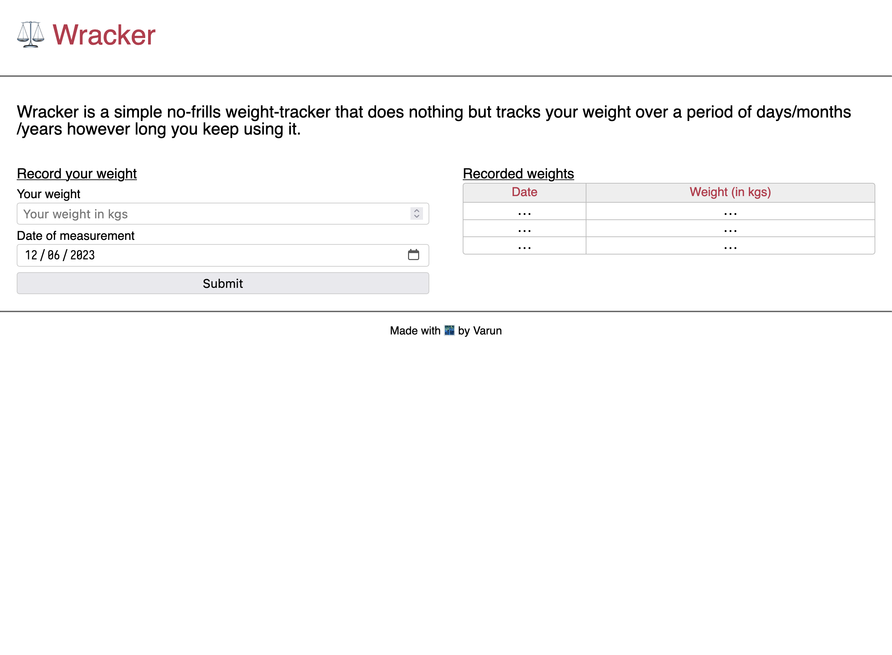
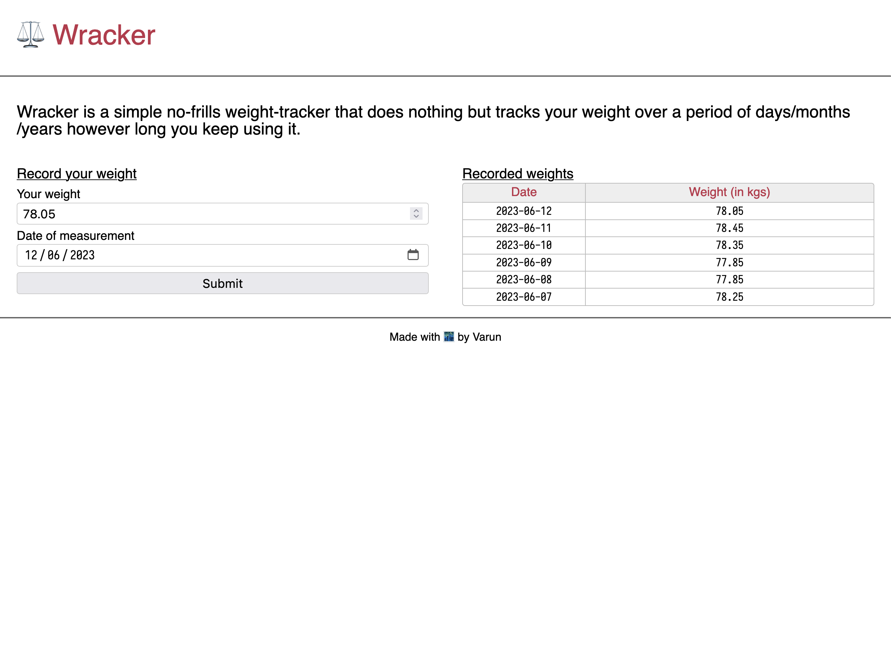

---
tags:
  - post
layout: post
title: "⚖️ Wracker Dev Log #002"
summary: "My experience making a usable form and working with HTML <code>&lt;table&gt;</code> for the first time"
date: 2023-06-12T19:35:00+0530
categories:
  - "wracker"
  - "programming"
  - "python"
  - "javascript"
---

Welcome to the second log of my journey to build a weight-tracking website. Today I worked on the form for adding a new weight entry and also on the table for displaying all the entries.

## Day 2 Challenge 1

First goal for today was to get a static HTML page served from my Django server as the homepage for the website. I couldn't figure out how to deal with `django-static` and so ended up rendering a template (with no data passed) from an endpoint. For now I just shoved all my CSS and JS for this page in the HTML file itself. I'll figure out how to deal with static files later.

## Day 2 Challenge 2

Next up on the task was to create a form which takes in the recording date (defaults to current date but user can change it) and allows user to enter their weight for that day. Then take that data and store it locally in-browser. I chose to go the `local-storage` path for this. The most cumbersome part for me was to get the form to look how I wanted it to. Other than form-styling, actually capturing and storing the data was quite straight-forward.

## Day 2 Challenge 3

The final task for me was to display the captured data in a table. Again, getting and processing the data to display was not the difficult part. The quirkiest section was when I wanted to turn the corners of my table round. Turns out, each cell individually gets their border and thus to only give the table rounded corners I had to select individual corner cells and then give them rounded corner for only the corner which was going to become a corner of the table.

## Results

The website with no data added.

The website with a few weight entries.

## Things I learned/solidified today

- How to style corners of a HTML `table`
- How to serve a HTML page from under Django
