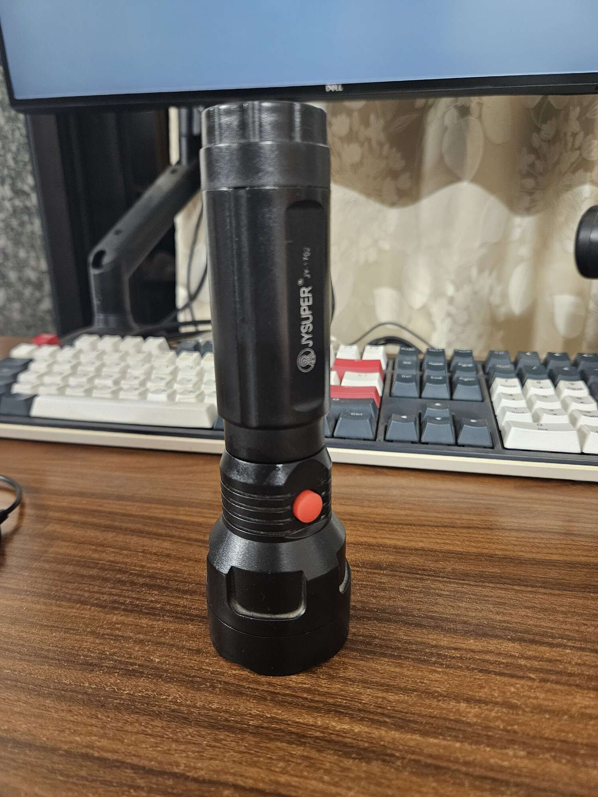

---
tags:
  - post
layout: post
title: "Fixing the torch 🔦"
summary: "I fixed a torch and that has made me extremely elated"
date: 2025-05-25T10:28:58+0530
categories:
  - "repair"
  - "personal-growth"
---

I DID IT.

I fixed a torch that was in a broken state for quite a few weeks now. The fix was not something complicated. I ended up disassembling it too much for what the original fix was (it turned out helpful though for another fix for another broken thing I found in the torch), and that made the reassembly a bit difficult. But it doesn't matter as much. What matters is that I did it. I finally disassembled it, found the problem and fixed it.

I have been wanting to get into hardware based projects for some years now and have never managed to break the barrier of entry. Always finding some excuse or other to justify it to myself. But yesterday was spent focusing on this torch and the barrier is down now.

Here's that torch in all its glory.

