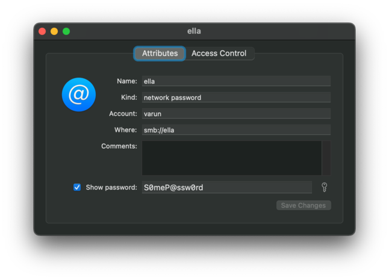

---
tags:
  - post
layout: post
title: "📝 Read SMB share password from MacOS Keychain"
summary: "TIL: How to access entries from MacOS Keychain programmatically, specifically an SMB share's record"
date: 2025-06-08T07:37:59+0530
categories:
  - "til"
  - "programming"
---

When building [valet](./project-valet) I needed to provide the password for my account on the SMB share hosted on my NAS. I did not want to input it every-time I run valet, but neither did I want to bake it in either the source code or in any build-time variable as then I have to recompile from source every time my password changes.

Since I already had it stored in my laptop's Keychain Access as it is used when I want to mount the share using Finder, I decided to try and read from there. All the online places mention how to retrieve either a record for a website account or retrieve a generic account. But none mentions an SMB share specifically.

Here's a sample entry stored in Keychain Access for an SMB share: 



## Accessing from shell/terminal

And here's the way to retrieve the password from terminal:

```shell
security find-internet-password -a "varun" -s "ella" -g -w "/Users/varun/Library/Keychains/login.keychain-db"
```

Here's what each option means:

- `-a`: Corresponds to the username
- `-s`: Corresponds to the server. In case of SMB share we don't have to enter the full-path (`smb://ella`) but only its name
- `-g`: Display the password for the item found
- `-w`: Display only the password and not the whole record

## Accessing from Rust

There is a nice crate in rust called [`security-framework`](https://crates.io/crates/security-framework) which handles things for us. Here's a snippet of how to get the password in a string in rust:

```rust
fn get_network_share_password() -> std::io::Result<String> {
    let keychain = SecKeychain::open("/Users/varun/Library/Keychains/login.keychain-db").unwrap();
    let (password, _) = find_internet_password(
        Some(&[keychain]),
        "ella",
        None,
        "varun",
        "",
        None,
        SecProtocolType::SMB,
        SecAuthenticationType::Any,
    )
    .unwrap();

    return Ok(String::from_utf8(password.to_vec()).unwrap());
}
```

## Articles related to project valet

1. [Project valet announcement](./project-valet)
2. Read SMB share password from MacOS Keychain (this article)
3. [Rust read build-time environment variables at run-time](./til-rust-build-time-env-vars)
