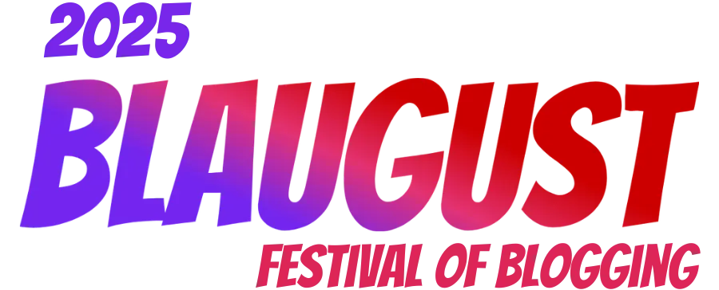

---
tags:
  - post
layout: post
title: "🎮 Games through the ages"
summary: "5 video games that captured me through the years"
date: 2025-08-03T08:00:00+0530
categories:
  - "blaugust-2025"
---

What is Blaugust? In my words, it is the annual month-long celebration of independent blogging and writing. If you want to read the words of the organizer, then I would guide you to the [official announcement post](https://nerdgirlthoughts.game.blog/2025/07/10/blaugust-2025-is-coming/), which also contains the link to the sign-up sheet.

Every year, people try to write & publish as much as they can for one whole month. I originally read about it in one of [Juhis' 2024 post](https://hamatti.org/posts/blaugust-2024-batteries-included/). This year, when he [posted](https://hamatti.org/posts/blaugust-2025-starts-august-1st/) that Blaugust 2025 has been announced, I decided to join too.

This is my first time participating, but I have set my sights quite high and am targeting the [🌈 Rainbow Badge](https://nerdgirlthoughts.game.blog/2025/07/10/blaugust-2025-is-coming/#:~:text=Rainbow%20Diamond%20Award). I already have too many ideas of things I want to write about ~~and update~~ (no Varun, focus on writing) on this site. Let's see how close we reach to our target.
