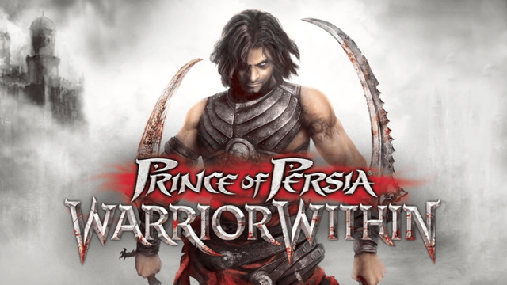
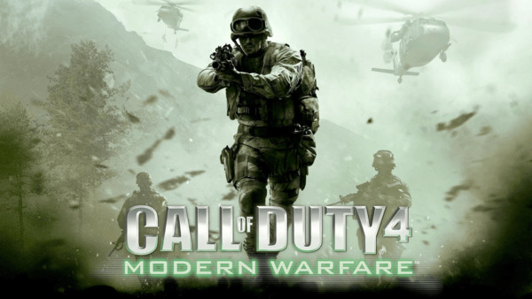
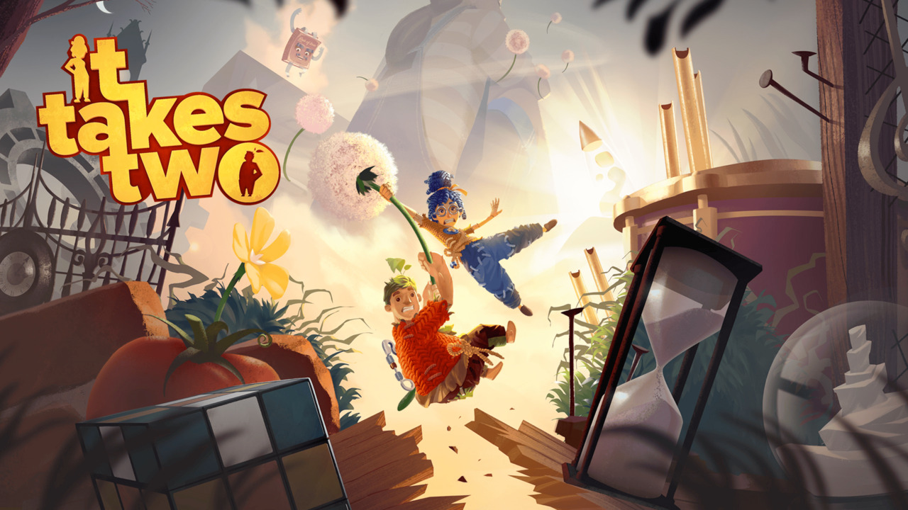
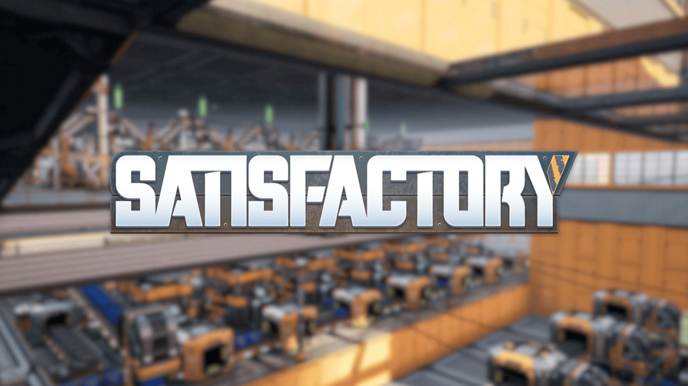

---
tags:
  - post
layout: post
title: "🎮 Games through the ages"
summary: "5 video games that captured me through the years"
date: 2025-08-03T00:24:04+0530
categories:
  - "blaugust-2025"
  - "video-games"
---

Video games have been a big part of my interaction with computers since childhood. For quite some time, I’ve wanted to write about some games that I enjoyed the most in their genre. So when planning for Blaugust, I thought that now would be the best time to post it. Here are some games that have left their mark on me over the years (arranged in the order I remember playing them):

## Prince of Persia: Warrior Within

This one is a nostalgia pick, as it was the first long-form game that I played (probably during my teenage years). It was also the first game for me that had alternate endings based on the actions you take. It had some very cool things going for it, like parkour mechanics, puzzle-solving, and time-control powers. But the best part was the scenes where one of the most terrifying villains, the Dahaka, chases after you.

- [Steam page](https://store.steampowered.com/app/13500/Prince_of_Persia_Warrior_Within/)

## Call of Duty 4: Modern Warfare

I cannot make a list of my recommended games and not have any FPS (First-Person Shooter) games in there. While this was by no means the first game I played in the category, it was the first I found I liked way too much. This game ticked a lot of boxes: abundant machine guns, guns with suppressors, snipers, grenades that you can throw back, stealth missions, and a banger soundtrack. While I don't remember the name of it, the mission that takes place in Pripyat still remains etched in my mind.

- [Steam page](https://store.steampowered.com/app/7940/Call_of_Duty_4_Modern_Warfare_2007/)

## Horizon Zero Dawn

**TL;DR:** You get to fight (and sometimes use) mecha-dinosaurs in some very pretty world environments.

I would say that even if for nothing else, play this game for its storyline. This one has the best story of any game I've ever played. After Skyrim, this was the first game I played where you start going from Point A to Point B, but you encounter side-quest(s) in between, and even hours later you might not have reached Point B. And the even better part is that those side-quests aren't repetitive.

> **Side note:** If you find the side-mission inside a quarry to be too difficult, there is a way to cheese it by remaining outside the quarry.

> **Minor spoiler:** Look up the guides online for "Shield Weaver" – it’s too good to miss out on.

- [Steam page](https://store.steampowered.com/app/1151640/Horizon_Zero_Dawn_Complete_Edition/)

## It Takes Two

This was the first game I ever saw where you have to have two players to play it. I am currently playing this with my wife, and these are some of the most creative graphics/visualizations that I have seen in a game. This game has an okayish storyline, but it is hidden by the wonderful environmental settings and writing (yes, the overall story is okay, but the writing in each section is fantastic). This game is a solid recommendation to play with a partner/sibling/roommate/parent (basically anyone you spend a good chunk of your time with).

- [Steam page](https://store.steampowered.com/app/1426210/It_Takes_Two/)

## Satisfactory

This game has somehow mastered the dopamine drip loop. If you have an engineering/systems mind, you should definitely give this a go. The premise is that you land on an alien planet and have to use the resources there to craft and ship a bunch of parts to the space station in orbit. The automation comes as a natural derivation from it. I haven't completed it yet, but I am very excited to start my rail network and ride the trains all around.

- [Steam page](https://store.steampowered.com/app/526870/Satisfactory/)

## Bonus entry?

There was originally going to be a bonus entry of one game, but as I was writing about each game, more and more fantastic titles came to mind. So I think I’ll publish a separate piece for them sometime in the future, probably.
