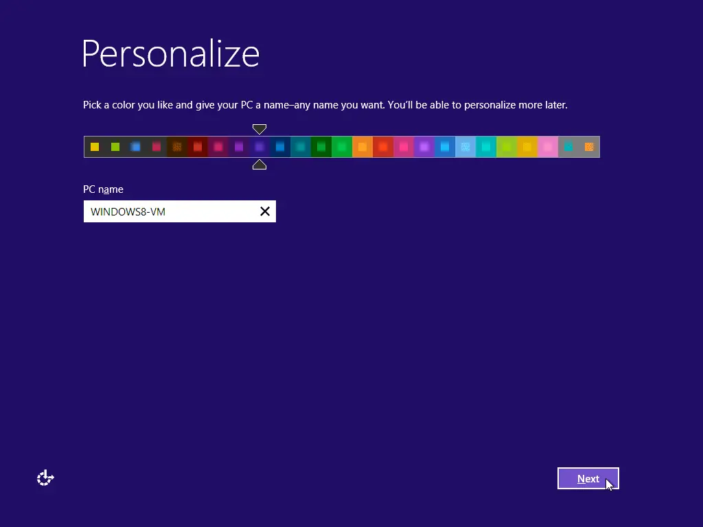

---
tags:
  - post
layout: post
title: "📇 Naming my devices"
summary: "How I have started to decide on names for my devices"
date: 2025-08-07T23:14:59+0530
categories:
  - "blaugust-2025"
  - "miscellaneous"
---

Every time since my childhood when setting up a new device, it asked me to give the device a name. The most common instance so far has been setting up my computer, and I would end up naming it something like "Varun Computer", "Home Computer", or something along those lines.

It is only in the past few years, after I read a post by someone on how they decide names for their devices, that the thought even occurred to me that those names for my devices don't have to be so dry and meaningless. That I can treat naming my devices with some thought put into it, and name them based on some theme or the purpose that they will be serving.

Since then, the theme I have started with my devices is "celestial bodies/objects". I try to name my devices based on some constellation. Here are some of the names I have assigned since then:

- __orion__, as it was the first constellation I had learned to identify in the night sky
- __andromeda__, as it is the nearest major galaxy to our own "Milky Way"
- __phoenix__, as that computer had completely crashed itself, but when fixing the hardware issue, the service center gave me a significant RAM upgrade as they didn't have the exact matching components
- __delphinus__ was given to my NAS, as it is the constellation containing dolphins, and when naming it I remembered that dolphins have good memory
- __scribe__: this is an exception, as it is both a project and a device. This is basically the name I am giving to a Raspberry Pi which is used to convert an old printer into a network-attached printer
- __aarohan__ was named before deciding on the theme, but it still had some thought put into it because that word in Hindi means "to ascend"

## Other people who have written on naming their devices

- [Juha-Matti Santala](https://hamatti.org/posts/naming-devices-is-fun/)
- [Robb Knight](https://rknight.me/blog/naming-my-computers/)
