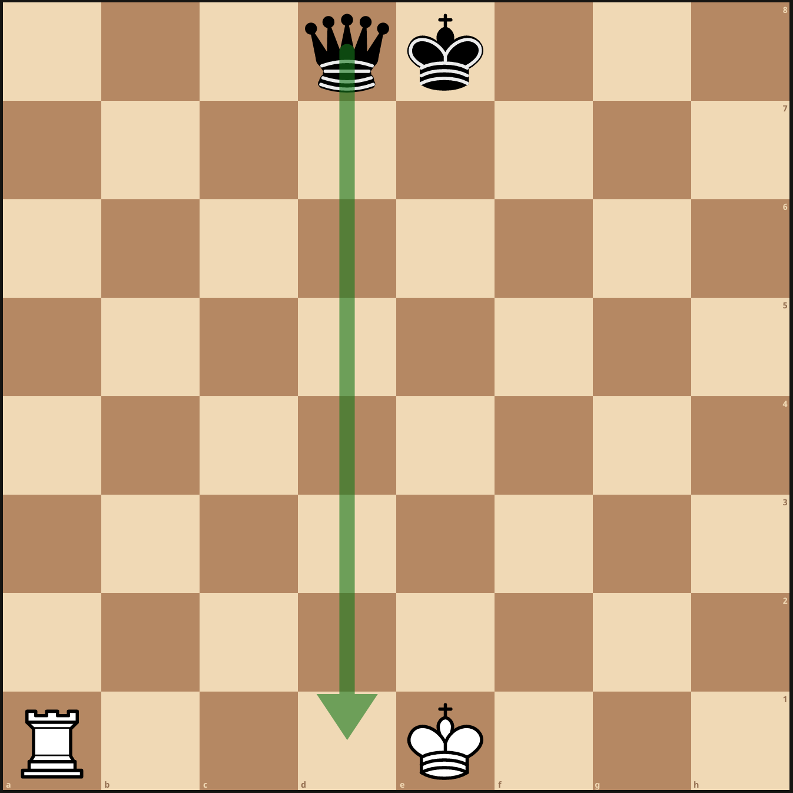
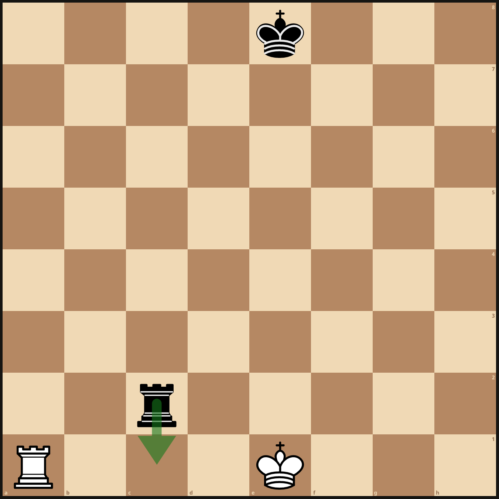

In one of our chess games at work I learnt that you cannot perform the castle move with King if the blocks where the king has to pass through or end at are under threat from any of opponent's piece(s).

## Examples

We cannot castle in this case because one of the midway blocks is threatened by black queen.

We cannot castle in this case because the square where king would end up is threatened by black rook.
