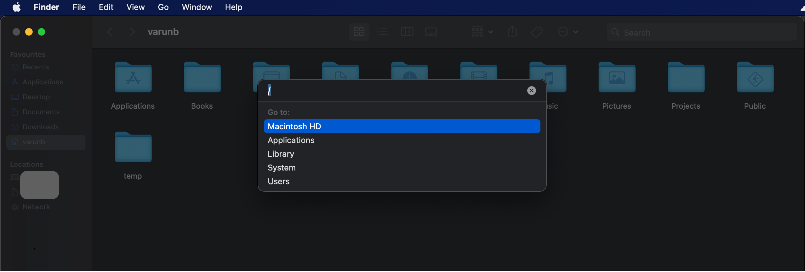

For many years I had a slight frustration with Mac's default file explorer utility Finder that it was not exposing any convenient way to go to a given path without making me click through those folders individually.

Today I learnt that the way to do it is to press `Cmd + Shift + G` when Finder is in focus. It opens a dialogue box where you can give the full path, and it will open that directly.

