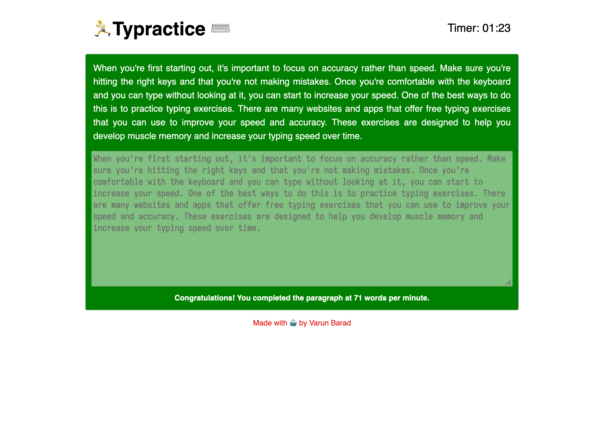

Recently someone I know wanted to improve their typing speed and accuracy. While there are a lot of websites available around to practice your typing, I took this as a chance to build my own which is free of any ads or tracking. Following my tradition of not-the-best puns, I present to the world: [Typractice](https://typractice.varunbarad.com). 

It's a simple website which gives you a random paragraph to type. At the end you are presented your typing speed in terms of words-per-minute. There is no mentioning of accuracy as it doesn't accept anything other than perfect text entry. The timer keeps going until you enter the whole paragraph correctly.

This is also the first time I tried writing it with the help of ChatGPT. Gave it a bunch of prompts, and it gave out a bunch of code. Both the functionality and appearance of the site were not upto my expectations, but I used it and then built on top.

The website also stores in-browser (all locally on your machine) how you performed on different paragraphs. I plan to add a stats page in the future which could show you how your performance changed over time, both overall and also for specific paragraphs.

Check it out and let me know what you like and what you would like to change about it. You can also send me screenshots of your best scores.

