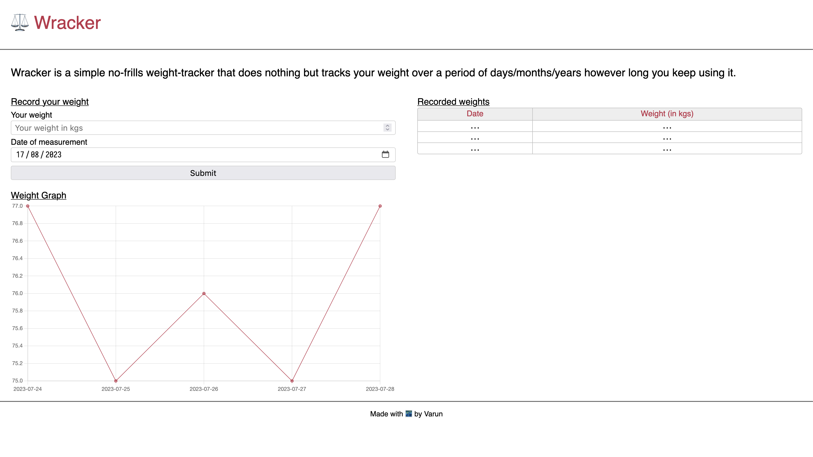
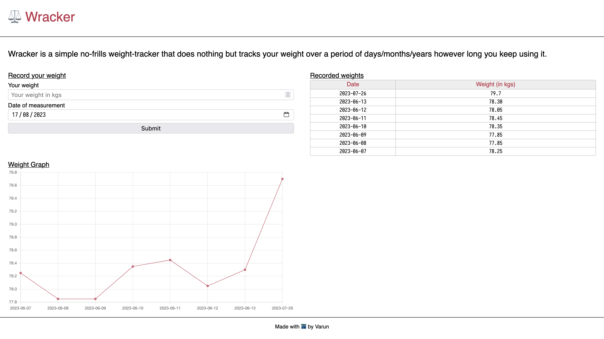

---
tags:
  - post
layout: post
title: "⚖️ Wracker Dev Log #003"
summary: "Adding a graph and moving away from django"
date: 2023-08-17T06:58:27+0530
categories:
  - "wracker"
  - "programming"
  - "python"
  - "javascript"
---

This is the third log entry for my weight-tracking project and the work covered today happened over multiple days. I added a graph of the weight entries and moved away from django to flask.

## Period 3 Task 1 (P3T1) - Adding a graph

Seeing the progress of my weight-change journey at-a-glance was a must for me and so a graph was required because it makes seeing the trend over time much simpler. I had already [added a chart recently to another project](./typractice-stats-chart) and went with the same [library](https://chartjs.org) and usage pattern. A simple chart of weight-entries against the date of measurement was all I needed. Screenshots of the results follow:

The website with no data added.

The website with a few weight entries.

## P3T2 - Moving from django to flask

My initial reasoning to go with django was because I wanted to learn a Python backend framework, but with how much different types of code-bases I was seeing when looking for "the" code structure for a django project I was getting confused. So rather than burn my efficiency trying to grok just django, I decided to move to a simpler backend framework [flask](https://flask.palletsprojects.com/).

I started by installing flask and then serving the same HTML file as a rendered template from flask. Once that was done, I removed all the django-related code from the codebase. That was followed by learning how static files are served in flask and then moving my styles and Javascript to separate static files. Final step was to move the Javascript file for the charting library in-house. I downloaded the minified version of the library with a simple `wget` and then moved it to the static folder and pointed my HTML file to it.

So far I would say that it is much easier to understand how things are happening in Flask than how they were happening in django. I am sure that django is a much more powerful framework but for my use-case, I think flask is more than enough.

## Things I learned/solidified today

- Serve static files in flask
- Serve an HTML file as a template in flask
- How to remove dependencies from a Python project
