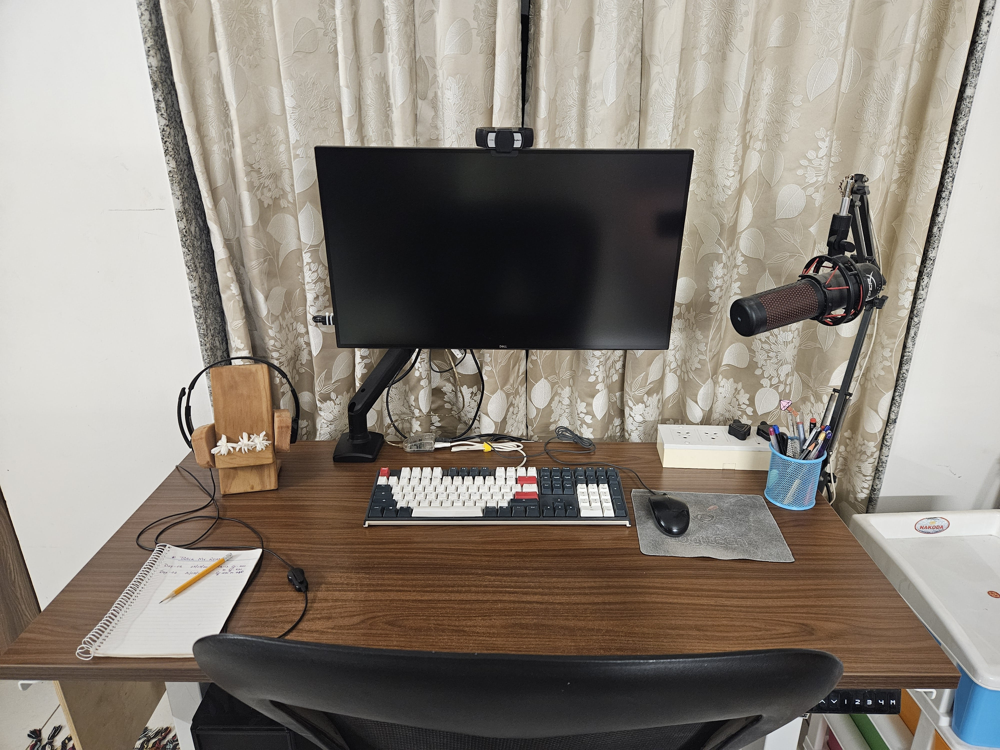

---
tags:
  - post
layout: post
title: "Installing my first monitor arm"
summary: "I installed my first monitor arm and it is a desk changer."
date: 2025-03-30T23:12:26+0530
categories:
  - "miscellaneous"
---

I don't know how I have not written any post in this year so far but here comes the auspicious beginning of the year.

I have always used my monitor/display on its company provided stand. Today was the first time in my life that I installed my monitor on an adjustable arm and it has done wonders in clearing space on my desk.

I have a 27 inch monitor and its stand was taking up a lot of space on my desk and I was not able to push my keyboard in as much as I actually wanted to.

As you can see in the photo above my dad even had built a wooden stand for the monitor so as both to raise it a bit and so that I get some more space to push my keyboard in. But it was not enough.

Now with the arm I can reclaim much more of the depth and real-estate of my desk. This has both increased the available space on my table and also improved the usability.

The desk is from [ErgoYou](https://www.ergoyou.in/) and I have been using it for more than 4 years now. Their product quality is top notch so I decided to go with the same vendor for the monitor arm as well. They had a few options at the time and I decided to go with the [single-screen G3 series one](https://www.ergoyou.in/products/adjustable-spring-monitor-stand-single-screen-clamp-grommet-mount-g3-series).

- I know the Playstation is no longer on the table in second photo. I would make the appropriate space for it the next time I want to play a game.
- The whole table also got a nice wipe-down in the whole process and that is one less thing I would need to do before starting my week tomorrow.
