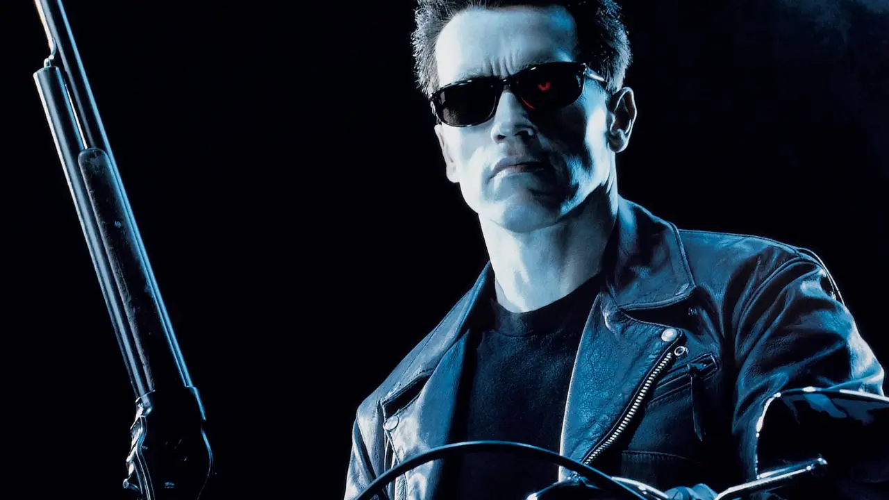
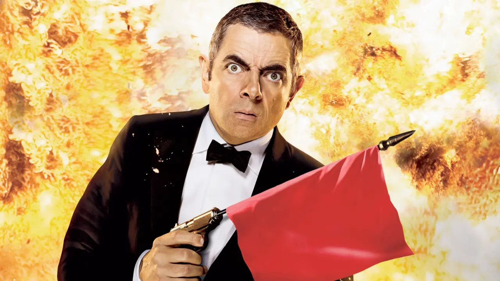
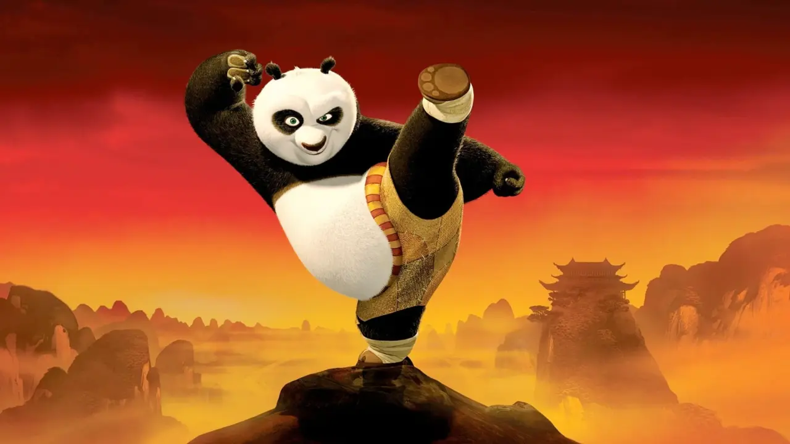
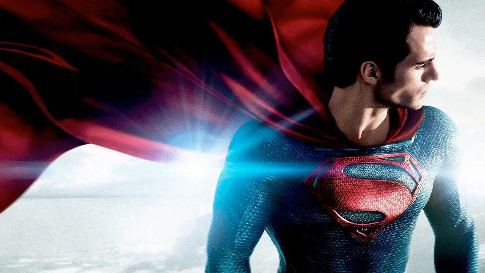
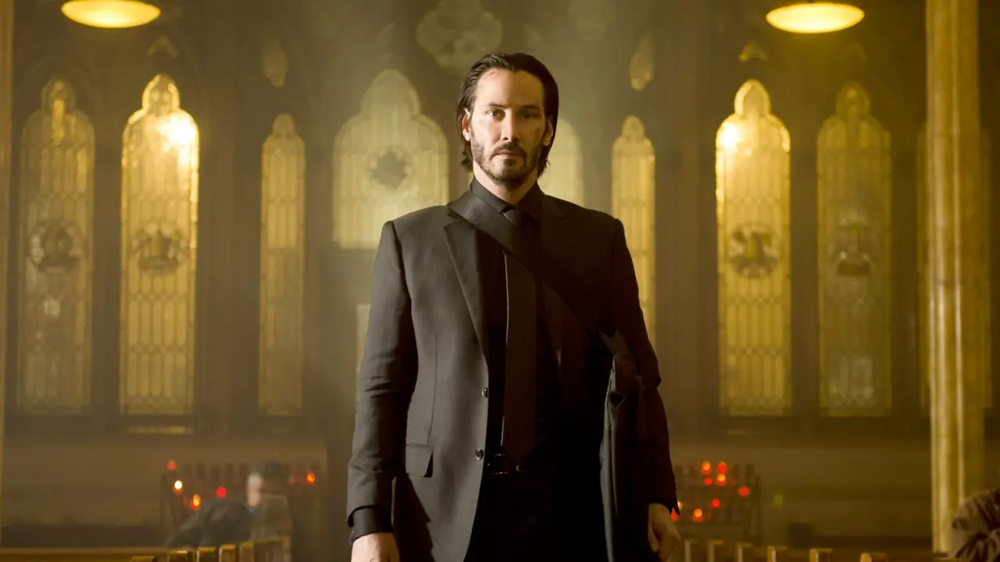

---
tags:
  - post
layout: post
title: "🎬 Movies through the ages"
summary: "5 movies I have watched countless times over the years"
date: 2025-08-21T10:38:41+0530
categories:
  - "blaugust-2025"
  - "movies"
---

When starting Blaugust, I had decided that I would share at least three listicles, one of each kind of media (books, movies, and video games), featuring my recommendations under each. Each [movie's score](./movie-rating-system) is marked alongside the title:

## Terminator 2: Judgment Day (Score: 5/5 🎖)

This must be the first science-fiction movie I remember seeing. The crunch of the first skull-crush is still embedded in my mind. The plot, the casting of both Arnold and Robert as T-800 and T-1000, and the effects are all top-notch.

The plot has a couple of robots coming back from the future, one to protect and one to eliminate. Pair that with action sequences containing car chases, gun fights, a minigun, and even a freaking grenade launcher. Somehow they still manage to fit in one small hand-to-hand combat that looks decent.

This is probably the only movie in the franchise I really enjoy and is a must watch for anyone who is a fan of science-fiction or action movies.

## Johnny English Reborn (Score: 4/5 👌)

This movie is not for people who take movies seriously. Rowan Atkinson assumes the role of an MI7 agent in his own quirky style. While there may be plot holes in the movie, it is a hillarious roller-coaster of a ride.

It is about Mr English (Rowan Atkinson) coming out of retirement to outsmart and beat Vortex, who are trying to assassinate the Chinese Premier during talks with the UK.

This is not the first movie in this series, or probably even the best one. But I got introduced to the series with this so I am mentioning this.

## Kung Fu Panda (Score: 5/5 🎖)

It takes having a great villain to even have the chance of having a great hero and this movie has one of the best written villain, Tai Lung, of all time. The scene of his introduction still remains the coldest intro any ~~villain~~ character has ever gotten.

The seriousness of Tai Lung is thoroughly matched by the insanity that is Po the panda (our protagonist). The character development that Po gets over the course of the movie is something that is quite relatable for kids and adults alike. My favorite characteristic of Po is that no matter how many punches he takes, he always stands back up to go another round.

## Man of Steel (Score: 5/5 🎖)

General Zod is another one of those villains who just steal the show. The difference between Superman and Zod become apparent when within a single day Zod adapts to the earth environment and is able to go toe-to-toe with Superman.

Henry Cavill fits the cape of Superman quite nicely. This is a classic Superman movie containing awesome visuals and a marvellous background score. I am yet to watch the newly released Superman movie, but so far this is my favorite one.

## John Wick (Score: 5/5 🎖)

> It's not what you did son, that angers me so. It's who you did it to.

And that is how you start a bad-ass introduction. Remember kids, never mess with someone who has retired from a job where people end up dying before leaving.

This franchise has some of the highest attention-to-detail gunfights. The protagonist is basically a killer machine making a weapon out of anything in his reach. Oh the magazine is empty, let me just throw the whole gun at the other guy's head.

This and many more such sequences ensue when a mafia's son kills the retired Baba Yaga's puppy. 
