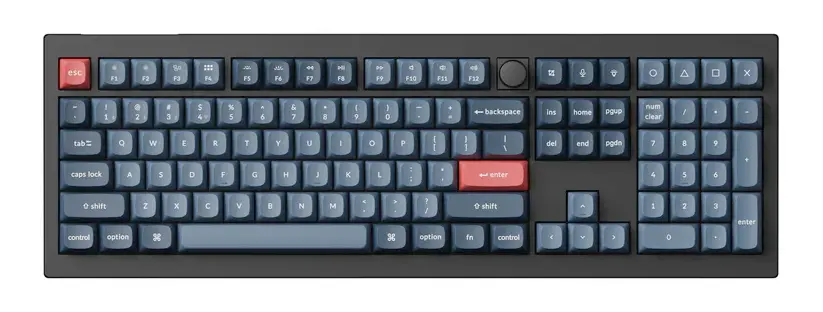

---
tags:
  - post
layout: post
title: "⌨️ Say hi to a new keyboard"
summary: "My first impressions with my new Keychron V6 Max"
date: 2025-08-22T21:54:41+0530
categories:
  - "blaugust-2025"
  - "toys"
---

After 4 full years with my trusty [Ducky One 2 Tuxedo](https://meckeys.com/shop/keyboard/100-keyboard/ducky-one-2-tuxedo/), I finally bought a new keyboard. There is nothing wrong with my old keyboard, it is functioning just as good as the day I bought it. I just wanted an upgrade.

## What did I choose?

My absolute minimum requirement was a proper full-size keyboard. None of those squeezing the arrow keys into the main section or moving the "Insert → Page Down" section around. So, after looking at the limited options available in the full-size mechanical keyboard segment, I decided to go with the [Keychron V6 Max](https://keychron.in/product/keychron-v6-qmk-custom-mechanical-keyboard/) (I went with the red switches).

## Why did I choose it?

It was literally the only mechanical keyboard available in India which ticked all the above boxes. And it also came with these upgrades over my existing keyboard:

- Triple connectivity options
  - Bluetooth
  - Wired
  - 2.4 GHz dongle-based
- QMK/VIA programmable
- Configurable backlight
- A rotary encoder knob
- Hot swappable switches

## How has it been?

I am sometimes hitting the wrong keys because of the slightly changed keycap profile, but otherwise the experience has been nice. After three weeks of use, I am back at around the same efficiency I had with my previous keyboard.

I haven't yet made any customisations to the keymap, but I plan to change some small things around this weekend. I'll report back next weekend with how that works out over the week.
