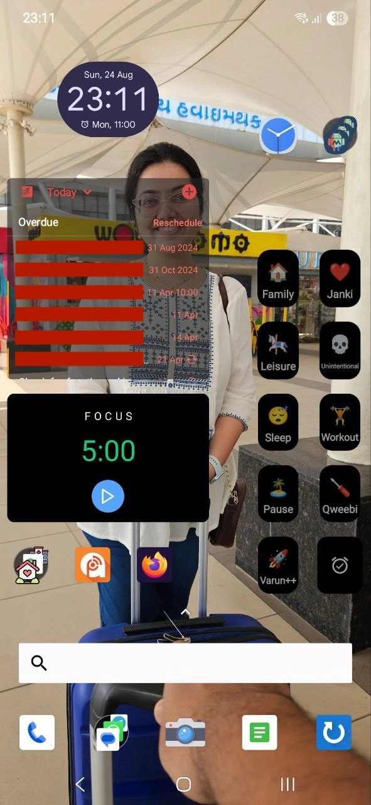

---
tags:
  - post
layout: post
title: "📱 What's on my phone home screen"
summary: "The one where I go through each and everything on my phone's home screen and explain why it is there"
date: 2025-08-24T18:04:27+0530
categories:
  - "miscellaneous"
  - "blaugust-2025"
---

Recently I saw [Jedda's post](https://notes.jeddacp.com/whats-on-my-iphone-home-screen/) on her phone home screen and thought I should also try something like that. Here we go:

Starting from the top-left, we have the usual clock widget which also opens my alarms when clicked. On the right of it we have a clock-like icon which opens a [Tasker](https://tasker.joaoapps.com/index.html) action which allows me to input a time and then sets 3 alarms at 15 min intervals starting from the entered time.

The three similar looking icons clubbed together on the top-right are display density controls made using [MacroDroid](https://www.macrodroid.com/). They allow me to set at three pre-set densities so that I can quickly make the display either more easily readable or make it contain more content.

Then the 10 widgets below those are my time-tracker shortcut widgets. I try to track all my time, mostly to discourage me from sinking my time where I don't want to. You can refer to this [Cortex podcast episode](https://www.relay.fm/cortex/44) to understand how that goes.

Then on the left the largest widget is for [Todoist](https://todoist.com), my task-management application of choice (please ignore the long overdue tasks). Below Todoist is [Focusmeter](https://focusmeter.app/), my pomodoro timer, widget.

Below Focusmeter on the left edge is my collection of navigation apps and shortcuts. I have Google Maps and [My Places](https://github.com/VarunBarad/my-places-android), and I also have three shortcuts for directly opening driving directions to my frequently visited places. Besides the navigation folder, I have my podcasts application [Podcast Addict](https://podcastaddict.com/), which is the best podcast listening app in my opinion. The third one is [Firefox](https://www.firefox.com/en-US/browsers/mobile/android/), my choice of mobile (and desktop) browser.

Finally, in the dock I have camera in the centre. On the left we have Phone and communications apps. And on the right we have my [bookmarking app](https://github.com/VarunBarad/to-read-manager-android) and my habit tracking app called [Loop](https://play.google.com/store/apps/details?id=org.isoron.uhabits&hl=en-US).

To launch any application not on my home-screen is generally launched by searching for it using the search bar seen just above the dock.
