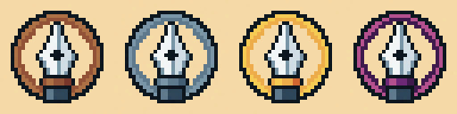

---
tags:
  - post
layout: post
title: "🏆 Gamifying blogging and personal site maintenance"
summary: "How adding small badges/achievements can improve the blogging experience"
date: 2025-08-27T23:21:49+0530
categories:
  - "blaugust-2025"
  - "meta"
---

I got an in-game achievement when playing a game recently - a small pop-up, a flashy badge, and that familiar burst of satisfaction. Last week when writing for Blaugust it struck my mind that we can make something similar for our own blogs.

A personal blog doesn't have to be just some posts on a page - it can be a game in itself, with milestones and badges for them milestones. That tiny bit of gamification can turn routine writing and site maintenance into a playful (yet capturing) quest.

I came up with some ideas along those lines, some are one-off while some have tiers to them. I have even designed progression badges for one of them.

## Writing & Publishing

- First Steps: Publish first entry
  - Writer: First blog post
  - Reader: First book review
  - Watcher: First movie review
  - Player: First game review
- Wordsmith: Wrote "x" words in total (the badges shown at the start were designed for this)
  - Bronze: 8,192 words
  - Silver: 32,768 words
  - Gold: 1,31,072 words
  - Amethyst: 5,24,288 words (so what if the fires are low, the ~~ambers~~ amethysts are still aglow :P)
- Centenarian: Publish 100 blog posts
- Speed Demon: Publish 5 posts in a week
- Scroll Roller: Write a post longer than 5000 words
- Series Samurai: Complete a multi-part blog series (3+ posts)
  - Bronze: First series
  - Silver: Three series
  - Gold: Seven series
  - Amethyst: 29 series

## Technical/Site Building

- Phoenix Rising: Finish a complete redesign
- Tinker Tailor: Add a new feature yourself
- Bug Basher: Fixed issues spotted by readers
  - Bronze: First issue fixed
  - Silver: Three issues fixed
  - Gold: Seven issues fixed
  - Amethyst: 15 issues fixed
- Mobile Master: Optimize site for a useful mobile experience
- The Real OG: Incorporate appropriate open-graph tags for better previews

## Creativity & Exploration

- Warrior: Write about a workout you like
- Chef: Publish the recipe of a dish you enjoy
- Maker Meta: Share a behind-the-scenes post of your workflow/workspace
- Challenge Accepted: Complete a writing challenge (NaNoWriMo, Blaugust, etc)
- Deep Diver: Write a detailed analysis piece

## Process & Discipline

- Early Bird: Publish a post before 7 am
- Night Owl: Publish a post after 11 pm
- Weekly Warrior: Publish a post every week.
  - Bronze: 4 weeks
  - Silver: 8 weeks
  - Gold: 16 weeks
  - Amethyst: 64 weeks (so what if the fires are low, the ~~ambers~~ amethysts are still aglow :P)
- Time Traveller: Schedule posts in advance
  - Bronze: One post
  - Silver: Two posts
  - Gold: Four posts
  - Amethyst: 16 posts
- Editor's Eye: Updated or revised an old post
