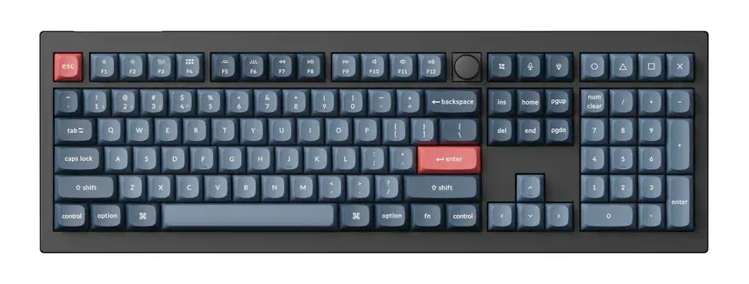
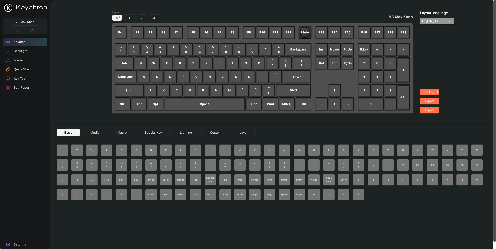

---
tags:
  - post
layout: post
title: "⌨️ Customizing the new keyboard"
summary: "Doing some basic keymapping changes with Keychron's web based tools"
date: 2025-08-30T20:05:13+0530
categories:
  - "blaugust-2025"
  - "toys"
---

This is my first keyboard where I can update its firmware to change the keymapping. There are mainly two ways to customize the keyboard: either using [Keychron launcher](https://launcher.keychron.com/) (Keychron's website based tool) or by directly reprogrammming the keyboard firmware using QMK/VIA.

I haven't yet used QMK/VIA route yet, but the Keychron launcher works well enough for simpler changes.

## What did I want to change?

I was a Windows/Linux user till about 5 years ago, so my brain/hands are wired to look for Cmd/Win key between Ctrl and Alt/Opt. Next on the line were my "Print Screen" + "Scroll Lock" + "Pause" keys. They used to act like F13 + F14 + F15, and I had them configured to different OS wide shortcuts. They moved further right, and I needed to move them back to above the Insert → Page Down cluster.

The last ambitious goal was to try and switch the usage of numbers and special characters in the number row above the main alphabets section. The default is when you press the key the number types, and when you do Shift + &lt;key&gt; it types the corresponding special character. I wanted to reverse this behaviour where the special character types by default and one would need to press Shift to type the numbers. I want that because as a programmer I use those special characters a lot and already have a huge num-pad in my keyboard if I want to input numbers.

## Simple changes were simple

The repositioning of existing keys was not a big deal. You just had to select the keys in layout, and then specify which key you wanted to set there. So both the changes were quickly taken care of.

## Launcher could not launch the ambition

The ambitious goal could not be met as Keychron Launcher didn't have the option to select normal operation and Shift + &lt;key&gt; operations separately. This needs to be done via reflashing the firmware, but that is not something I was willing to try yet. Maybe some other day.

## PS: Some keys are acting up

As I am typing this I am noticing the my "M" key and "Delete" keys are acting up. The M key would end up multi-typing a lot of times and the Delete key just straight up doesn't get detected some times.
