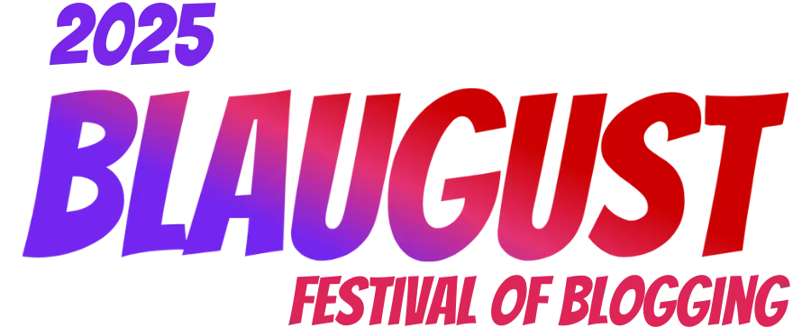

---
tags:
  - post
layout: post
title: "📜 Blaugust 2025: Nice knowing you"
summary: "How was my overall experience with my first Blaugust? Did I meet my goal? Will I come back again next year?"
date: 2025-08-31T13:23:41+0530
categories:
  - "blaugust-2025"
---

And that's a wrap. At the start of this month I set my sights on the Rainbow Diamond badge, which demanded I write 31 or more posts in this month. This is the 31st post, the final one.

It was punishing as hell. My wife put it best, she said, "Since school times, you haven't liked doing a single day's homework. And you thought you would be happy signing up for 31 days of homework?"

I have always been a person who doesn't like the process of writing, but I like having written. These past 31 days have been similar. I ended up putting a lot of things I love doing on the back-burner. I did not read books, I did not play video games, I did not watch any movies, I did not work on any side-project code.

All of my available free time was going towards Blaugust, even when my brain would have been much happier to do something else. It made me miserable, I don't like being miserable. But this Blaugust was a test of discipline for me, and I was not prepared to lose.

Neither was I prepared enough to win 😅. I believe that a hard-fought victory is not really a victory, it is at best not-a-defeat. Okay, I have got all the rant out of me, now on to the good parts.

Did I enjoy it? A heck of a lot. No doubt about that. The community was really nice and I found quite a few other blogs which I enjoyed reading. This month was finally the time when I felt that someone other than me also reads my blog.

Having to write ~~daily~~ regularly also helped me expand into other domains that I wanted to for quite some time. A bunch of old drafts and ideas also got dusted off and turned into full posts. It also taught me that if I just have a topic then I can turn that into a blog post if I just sit and start typing. I don't need to wait for an inspiration or to feel the right time or anything of that sort.

Would I participate again next year? Definitely. I will be participating each year that I can, but I won't be setting the same target for myself. It was a one-time experiment for me, and I am happy that I did it. Blaugust is great, and now I understand why first timers are not suggested to target the Rainbow Diamond badge.

There were a lot of times when I missed the day's post, but weekends were my friend, they helped me bounce back every single time. Here's a graph of what the standard rate of posting required me to publish and how I actually ended up publishing.

PS: I am literally finishing this at the last hour, it is past 11:30 pm on Aug 31 in India right now.
