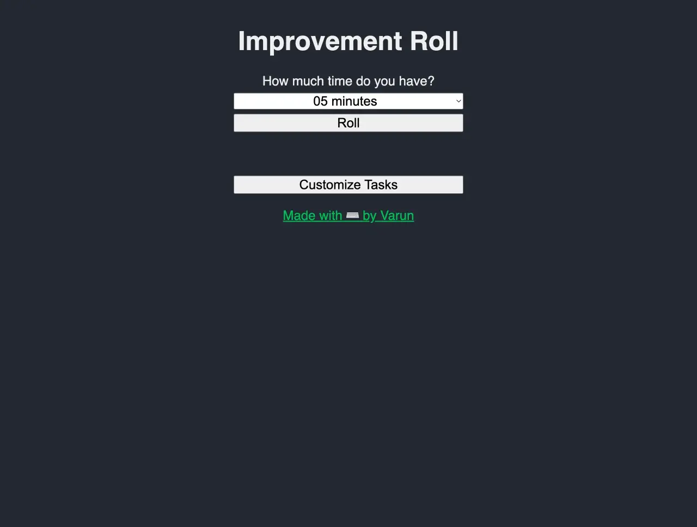
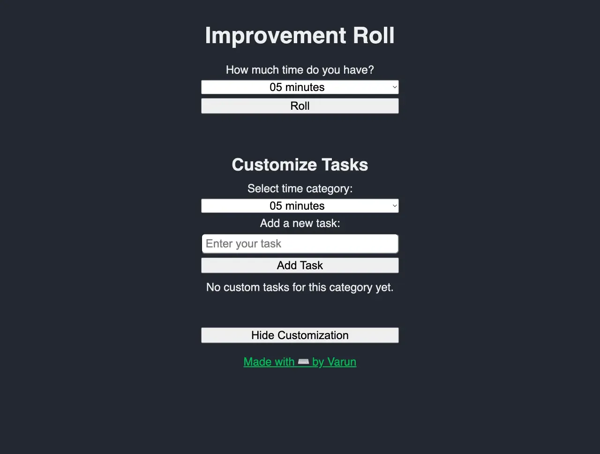
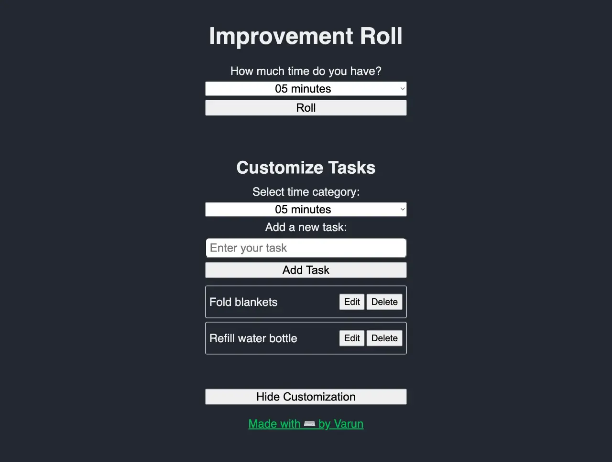

---
tags:
  - post
layout: post
title: "🎲 Implementing a four year old feature request"
summary: "I finally implement a feature-request made four years ago by a friend"
date: 2025-12-20T09:45:00+0530
categories:
  - "improvement-roll"
---

I released [Improvement Roll](https://improvement-roll.varunbarad.com/) back in 2021 and the first thing that my friend [Chandru](https://druchan.com/) asked was that he wanted to add his own tasks to the list. I was reluctant to add more JavaScript to the project back then and so denied it completely. Lately I have been working more and more on websites and web-apps and thus became open to adding that functionality, but I still did not want to put in the actual effort of doing that.

In AI code agents I have used Claude Code a bit but haven't really given Cursor a shot. So I wanted to try this project with Cursor, and see how far I can push it without writing a single line of code manually.

I started by having the customisation controls and inputs on a different page (/customise), but when I used that version it didn't feel right that I had to go to switch between pages to enter and roll a task. Finally ended up with having a button on the home-screen which shows/hides the controls and inputs for customisation.

I did all of this without writing a single line of code myself. But there was one odd thing, the items in the list of custom tasks would show up much wider than the rest of the elements of the page. By the time I was able to track down why it was so, it was easier for me to just make the change myself than to ask Cursor to do the same. So in the end I didn't escape this adventure without coding myself, but got very close to it. Maybe I should have just asked Cursor that the list appears much wider and to match its width with other elements, but I am happy with how things went. You can [check it out yourself](https://improvement-roll.varunbarad.com/) or check out the screenshots below.

<figure>
  
  <figcaption style="text-align: center;">Default homepage with button to toggle customisation controls</figcaption>
</figure>

<figure>
  
  <figcaption style="text-align: center;">Form to enter custom tasks</figcaption>
</figure>

<figure>
  
  <figcaption style="text-align: center;">List of custom tasks</figcaption>
</figure>

## Articles on this project

1. [Public release](./improvement-roll)
2. Adding custom tasks (this article)
