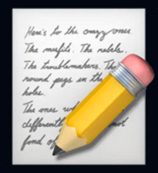

---
tags:
  - post
layout: post
title: "📝 The Memo emoji (📝) contains actual text"
summary: "The unicode memo emoji on mac contains text of a very famous poem"
date: 2025-12-24T10:45:35+0530
categories:
  - "miscellaneous"
  - "til"
---

Recently when writing another one of my TIL entries, I got curious whether the 📝 emoji on mac contains actual text or is it just some scribbles.

<figure>
  
  <figcaption style="text-align: center;">Screenshot of memo emoji taken on a Mac OS device showing the text written in it</figcaption>
</figure>

Turns out, it does contain actual text, and that too from the famous poem "Here's to the crazy ones". I first heard that poem at the end of the [Jobs movie](https://www.thetvdb.com/movies/jobs).

Now when I was researching for this article, I found out that it was originally part of Apple's "Think Different" ad campaign back in the day (source: [Basic Apple Guy](https://basicappleguy.com/basicappleblog/heres-to-the-crazy-ones)). And it turns out the same poem shows up in multiple emojis and at many other places throughout the whole system.

While I am not generally a fan of Apple and its recent design decisions of the past few years, I don't expect this level of nice design from any other major tech company.

**:chefs_kiss:** (I wish unicode had this emoji)
