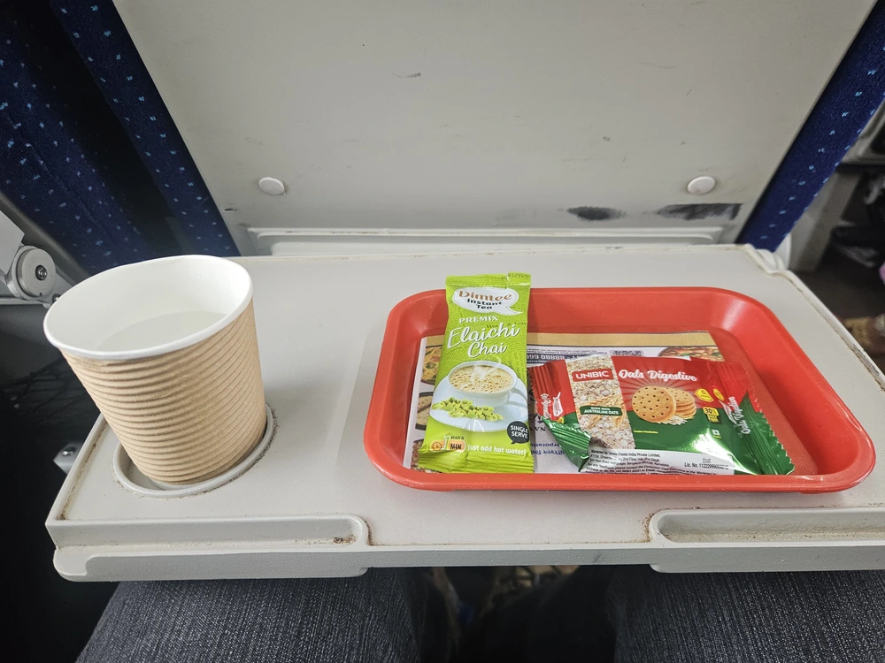
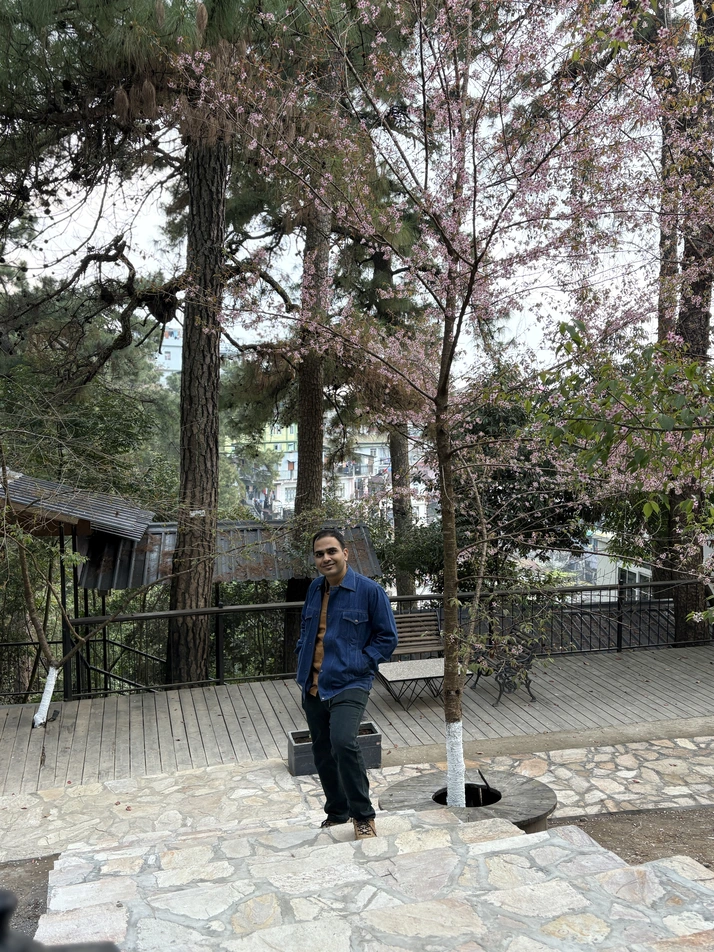
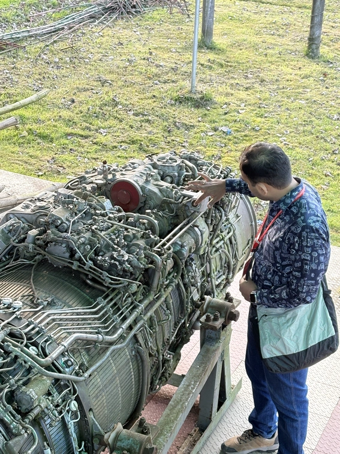
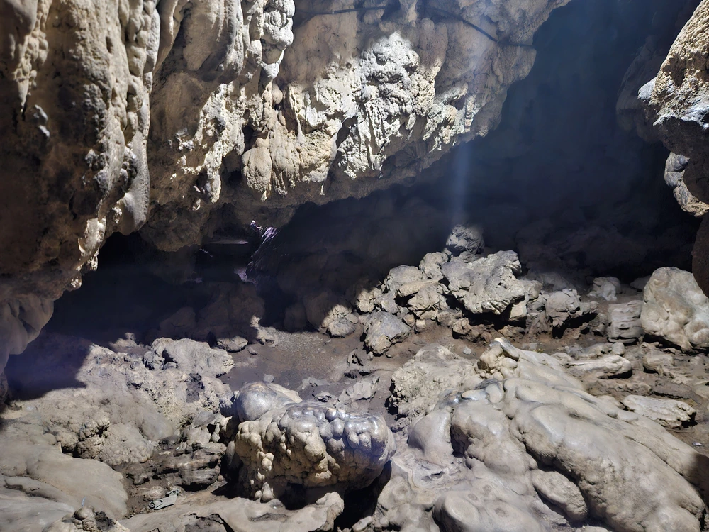
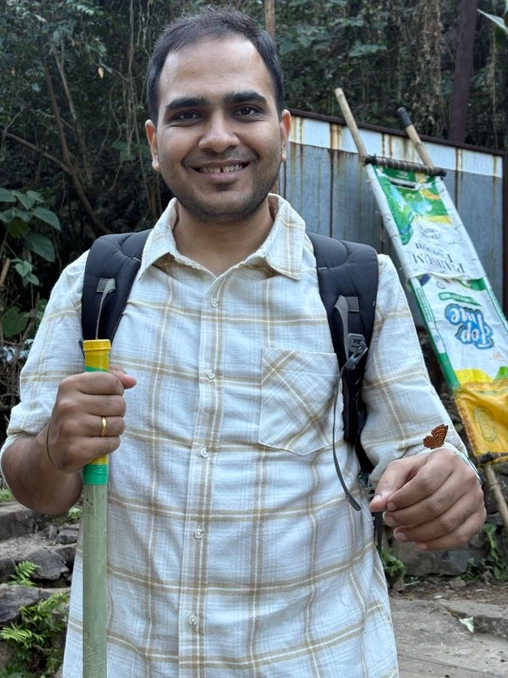
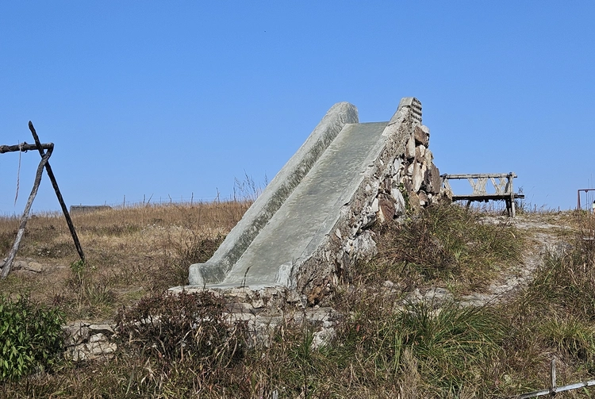

---
tags:
  - post
layout: post
title: "🧳 Meghalaya Trip 2025"
summary: "Log of my recent trip to Shillong and Cherrapunji"
date: 2025-12-29T19:41:25+0530
categories:
  - "travel"
---

Slowly continuing our journey northwards in terms of trip-destination selection, this time me and my wife decided to visit Meghalaya in the last week of November when she got a bit of a break from her job. Here's the day-wise log of our adventures.

## Day — 0 (My first trip on a Vande Bharat Express)

Since neither of us had ridden on a [Vande Bharat Express](https://en.wikipedia.org/wiki/Vande_Bharat_Express) before, we decided to reach Ahmedabad a day earlier than our flight so that we could take the Vande Bharat from our town to Ahmedabad. The ride was a smooth and speedy experience. But what I didn't expect was how completely booked it was, despite the tickets being on the pricier side. This was the fastest I have gone from my town to Ahmedabad. And since this is a train and not a plane, there was the added benefit of not having to bother with any sort of security checks and stuff.

In the evening we decided to visit a newly opened attraction [SPECTRA - MUSEUM](https://maps.app.goo.gl/t6aqXZNhZrcPFBBZA) (they call it a museum but I disagree). It was very costly and completely worthless. The only good thing that came out of it was that we played in a ball-pit for the first time.

> PS: Indian Railways still have Indigo beat by a wide margin on included snacks.

<figure>
  
  <figcaption style="text-align: center;">Complimentary snacks aboard the Vande Bharat Express</figcaption>
</figure>

## Day — 1 (Reaching Shillong, some lake and some blossoms)

After taking an early morning flight to Guwahati, we got on a cab to our hotel in Shillong. We were going to visit Umïam lake on our way there. It is a huge reservoir lake built for Umïam Dam on the Umïam River. There is a very nice walking trail going around the lake, and just above it there is also a wooden trail which goes around at a similar level as the tree canopy. Overall a wonderful experience 😍

On reaching our hotel (we stayed at the wonderful, and highly recommended by me, [The Heritage Club - Tripura Castle Hotel](https://www.tripuracastle.com/)) we noticed that there were a lot of cherry blossom trees on the premises, and by our luck they were in bloom too. We wanted to visit Japan during the cherry-blossom season and had never managed to so far, no one told us that there are cherry blossoms in India too 🌸. Now we can plan our Japan trip without worrying about these at all.

> PS: On reaching here, remember to ask for their awesome turmeric-based welcome drink :chefs_kiss:

<figure>
  
  <figcaption style="text-align: center;">A random Varun spotted posing besides a Cherry blossom tree. Photo credit: My Awesome Wife</figcaption>
</figure>

## Day — 2 (The day I touched a real jet engine)

On our second day in Shillong we visited three different places, the Laitlum Canyon, Shillong Peak and the Air Force Museum at Shillong. [Laitlum Canyon](https://maps.app.goo.gl/WLS92YiePHscM21W6) is a view point which can easily make you realise how tiny you are on this [Pale Blue Dot](https://www.youtube.com/watch?v=wupToqz1e2g). [Shillong Peak](https://maps.app.goo.gl/JVtJtbfvyUdFgvhC6) gives you a complete view of the Shillong city situated inside the valley. Only Indian citizens are allowed to visit Shillong Peak as you need to pass through the Indian Air Force campus to reach there.

Like [in Goa](/blog/trip-goa.html#:~:text=Naval%20Aviation%20Museum), we found an armed forces museum in Shillong too, so we just had to visit there. The [Air Force Museum](https://maps.app.goo.gl/GBGaKdnMTrgXZk1K9) (here is the link to [official website](https://airforcemuseumuppershillong.in/)) is situated inside the campus of Eastern Air Command and is open all days of the week. It houses different galleries and exhibits including:

- Various peacetime and wartime gallantry awards/medals
- Pictures and stories of IAF's contribution in the different wars
- Models and photos of various aircrafts (both planes and helicopters) that have been part of the IAF
- Various summer, winter and ceremonial officers' uniforms
- Some life-size and some scaled-down versions of different missiles and air-to-air rocket launchers
- A few life-size replicas of different aircrafts
- :drumroll: A real decommissioned jet-engine from a MiG jet

<figure>
  
  <figcaption style="text-align: center;">Me poking in stuff on a jet-engine</figcaption>
</figure>

## Day — 3 (Discovering that spelunking is not for me)

Today we travelled from Shillong to Cherrapunji, stopping at various spots on the way. First of which was [Elephant Falls](https://maps.app.goo.gl/6BPtFpSnbQXqTVAF9), which is actually three subsequent waterfalls, with the last one looking like a multi-step fall by itself.

Next up was [Garden of Caves](https://maps.app.goo.gl/7jFvyfQA4b2Kddv18) which contains around 11–13 different viewing points consisting of different waterfalls and various cave structures. Some of these cave structures appear as if they must have been inhabited in the past. You might easily spend over multiple hours going through all of them.

After that we moved on to the [Nohkalikai Falls](https://en.wikipedia.org/wiki/Nohkalikai_Falls). At a plunge height of around 340 metres, this waterfall is the tallest plunge waterfall in India. While there we also had the pleasure of listening to a live band performing various film songs 🎶.

Our last stop before reaching the hotel was [Mawsmai Cave](https://maps.app.goo.gl/WorVNvDCKcWNo4927) formations. These are limestone caves carved over thousands of years of chemical erosion. It was around 150 metres in length and became a tight-squeeze at many spots on the way. With uneven footing, low ceiling and such tight spots I would say this is not a place for people with health conditions or those with [claustrophobia](https://en.wikipedia.org/wiki/Claustrophobia).

<figure>
  
  <figcaption style="text-align: center;">A place inside the Mawsmai Cave where it widens up</figcaption>
</figure>

## Day — 4 (The day I became a disney princess)

On our fourth day we had booked a trek to a [double-decker living root bridge](https://maps.app.goo.gl/iUceSDDGk9sQMQkP6). This was a tough but equally rewarding experience. We started the trek from right near our hotel. It is said that it takes approximately 3500 steps of climbing up and down to reach from the start to the double-decker bridge. On the way we ended up crossing the river multiple times, including over rocks and via cable bridges. At one place there is even a small single-decker root bridge.

Near one of the villages on the way, a butterfly ended up landing on my arm. It even stayed there for around 50 metres or so. That's it, I finally became a Disney princess without even expecting to 🦋.

The double-decker bridge even has a small tank/pond like structure built underneath it, and that has a lot of fish in it. Neither of us had expected that we would be going for a fish spa, and that too in the middle of a trek. But there we were, getting our feet tickled by those critters 🐟.

From the root bridge, there even are a couple more view-points further along the trek, [Blue Lagoon](https://maps.app.goo.gl/U6xqMbYF46bNQUC78) and "Rainbow Falls". We weren't able to visit the Rainbow Falls but we did go till Blue Lagoon. It is a natural small(ish) pond created by a low-height waterfall. The water there is crystal clear, and my favorite part was that you can rent life-jackets (which are compulsory) from the locals there. So there was no worry in swimming even if you don't know the first thing about it. We ended up swimming around for about half-an-hour there.

The trek back was one of the physically most challenging things I have ever done in my life. Since we had to climb back up all those more than 3500 steps we had climbed down to reach the Blue Lagoon. At the end of day, both of us were tired to our bones, but neither of us, if given a do-over, would choose anything different.

<figure>
  
  <figcaption style="text-align: center;">Me posing with the butterfly on my left arm</figcaption>
</figure>

## Day — 5 (Back to base)

On our last day we had nothing on the roster other than getting back to Guwahati airport and subsequently back to home. On our journey back from Cherrapunji to Guwahati we also ended up getting a view of the Bangladesh territory. I did not expect this, but what is a trip without a few surprises.

If you ever visit Meghalaya, then make sure to hit these places while there:

- Double-Decker Living Root Bridge (do make sure to go till Blue Lagoon)
- Garden of Caves
- Elephant Falls (the café after the first fall makes delicious brownies)
- Air Force Museum, I don't know of many (if any) other places where you can see a real jet engine up close
- If within budget, then choose to stay in The Heritage Club - Tripura Castle Hotel while in Shillong

<figure>
  
  <figcaption style="text-align: center;">The most durable slide I have ever seen</figcaption>
</figure>
