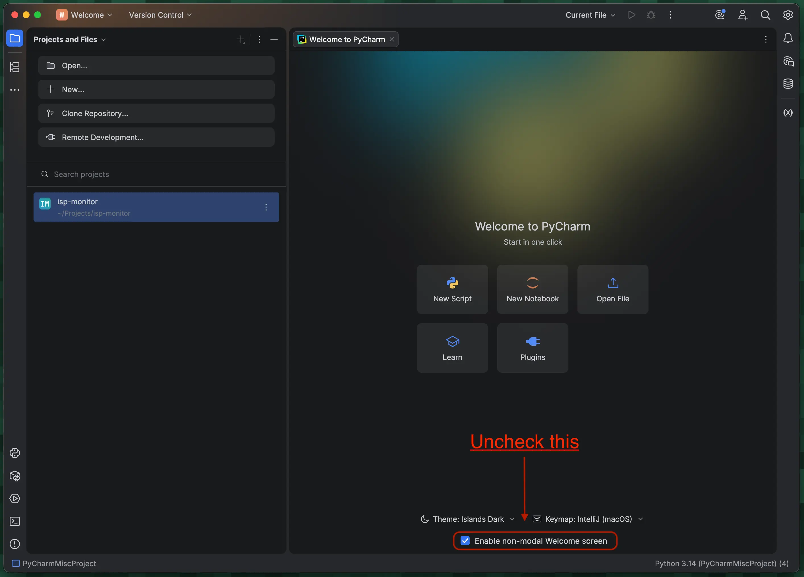

---
tags:
  - post
layout: post
title: "Prevent PyCharm from creating the PyCharmMisc project"
summary: "How to prevent PyCharm from creating the PyCharmMisc project on startup"
date: 2026-03-24T07:10:07+0530
categories:
  - "programming"
  - "python"
---

Solution source: [Tiago Candeias on JetBrains forums](https://platform.jetbrains.com/t/how-to-prevent-pycharm-from-creating-pycharmmiscproject-by-default/3107/5)

The PyCharm IDE now creates a project named "PyCharmMisc" in your home directory. I guess it might be to make the IDE's onboarding experience simpler for novice users, but I don't want it to clutter my home directory.

1. Save and close all your other open projects in PyCharm
2. Uncheck the "Enable non-modal Welcome screen" checkbox at the bottom of the "Welcome to PyCharm" tab/screen
3. Close PyCharm
4. Delete the "PyCharmMisc" project from your home directory
5. Open PyCharm, it should now open with the list of your projects (how it used to)

<figure>
   
  <figcaption style="text-align: center;">Screenshot of PyCharm with an arrow pointing to the checkbox that needs to be unchecked</figcaption>
</figure>
