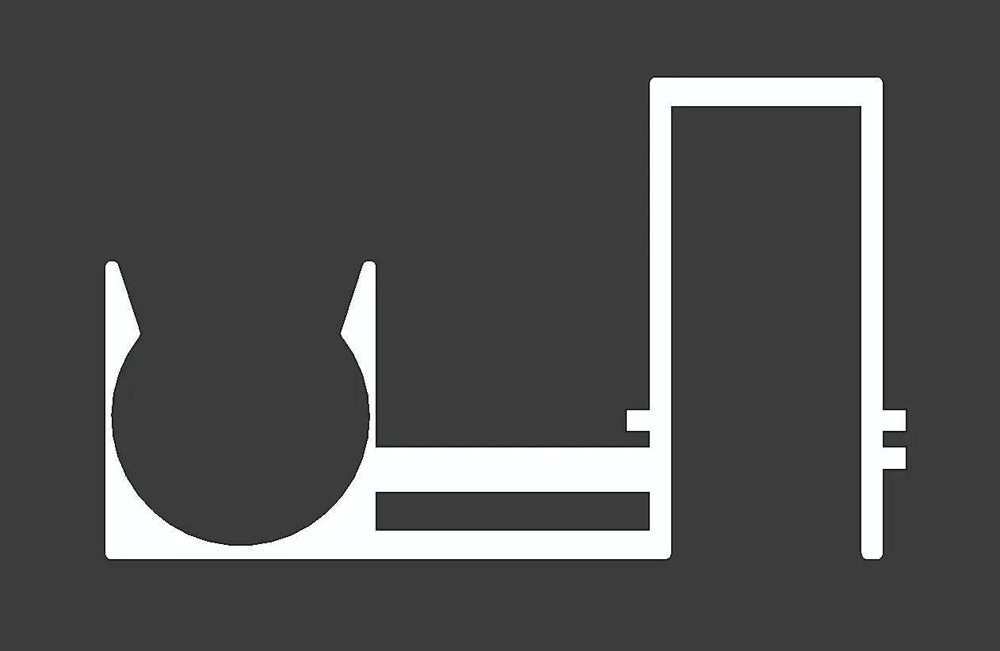
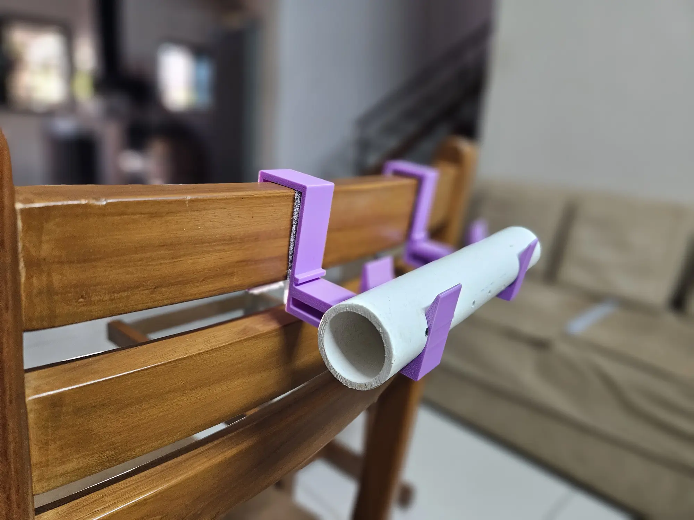

---
tags:
  - post
layout: post
title:  "My first 3D model that I am proud of"
summary: "I designed a bracket with a snap-fit mechanism, and I am proud of it"
date: 2026-04-16T07:44:58+0530
categories: 
  - "personal-growth"
---

I own a 3D printer since last year and while I have printed a bunch of different things on it, most of them were not designed by me. They were mostly models that I was just downloading from internet and printing out as I needed. There were some that were designed by me but they were extremely simple like some tokens for a board game, or a fridge magnet, etc.

But ~~this week~~ a few weeks ago (I am finishing this post much later than when I started) I designed a hook/bracket for my mother to hang her macrame support stick (a pipe in her case) from a chair's back. The portion where the actual support stick goes into the bracket is a snap-fit. So the user can put the stick in an take it out as they like, but the stick would not move out by other movements while working on the macrame threads.

When I first held the printed version of this in hand, it made me feel that I also can make actually useful stuff and not just more cheap plastic waste.

<figure>
   
  <figcaption style="text-align: center;">Cross section of the bracket with the snap-fit mechanism on the left side</figcaption>
</figure>

During designing it felt like the walls around the stick were too thin for the snap-fit to work correctly, but I also didn't want to thicken them up so much that they would not bend at all. I kept thinking that swapping the support stick in-and-out a few times would cause the walls to permanently deform. Thus losing the shape which made the snap-fit mechanism work in the first place. Then when the printer started printing and I saw a few layers come up, that feeling grew stronger as there was no in-fill material at those points, it was just a couple of wall layers. I thought of but decided not to cancel the print.

I only printed out one to begin with (I actually needed two) and when it was finally done, the snap had just the right force. It was also not causing any sort of deformation even after swapping the stick in-and-out more than a few dozen times.

<figure>
   
  <figcaption style="text-align: center;">The bracket in use on a chair with the support pipe snapped into it</figcaption>
</figure>
