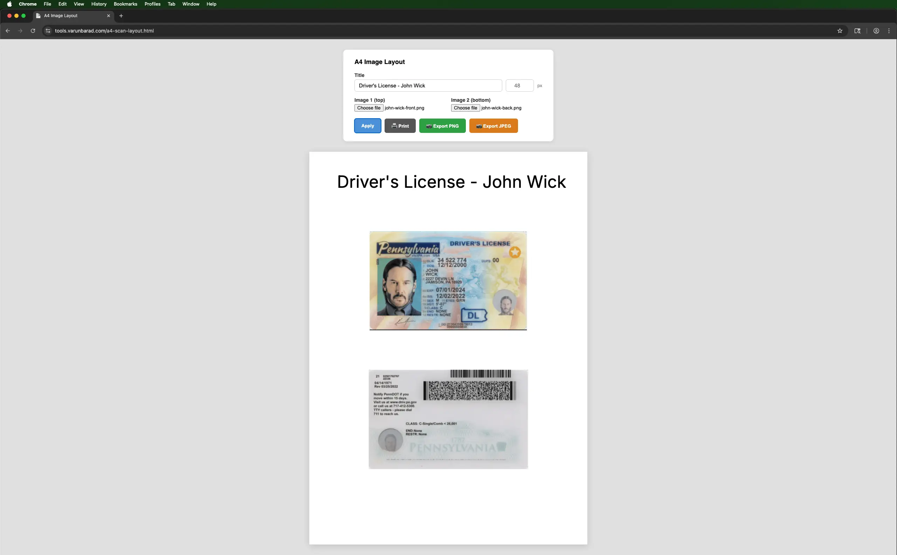
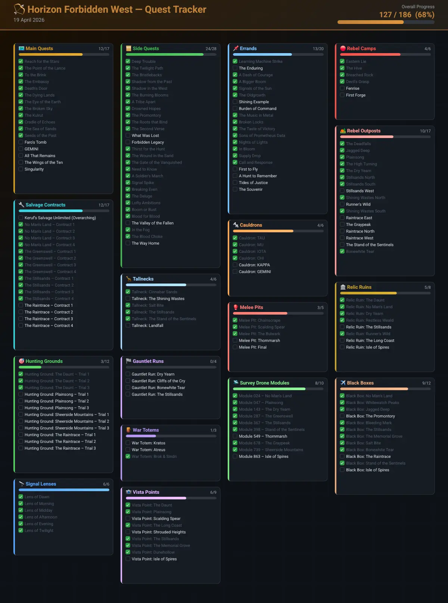
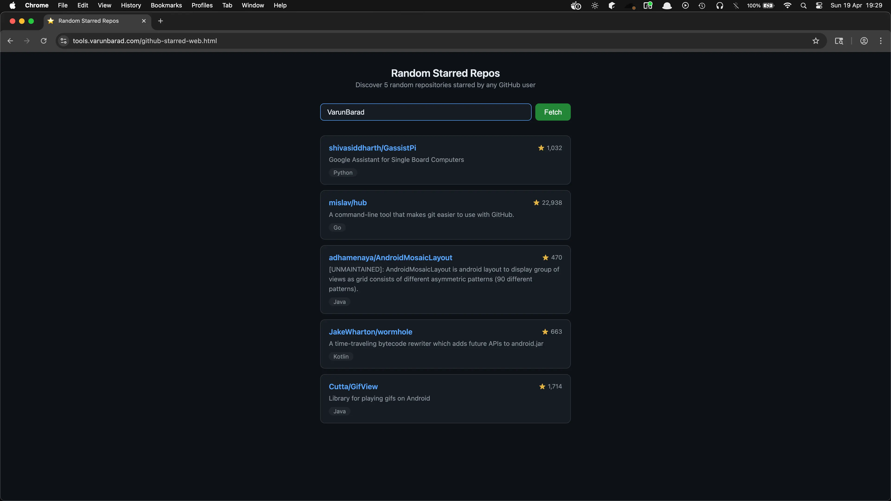
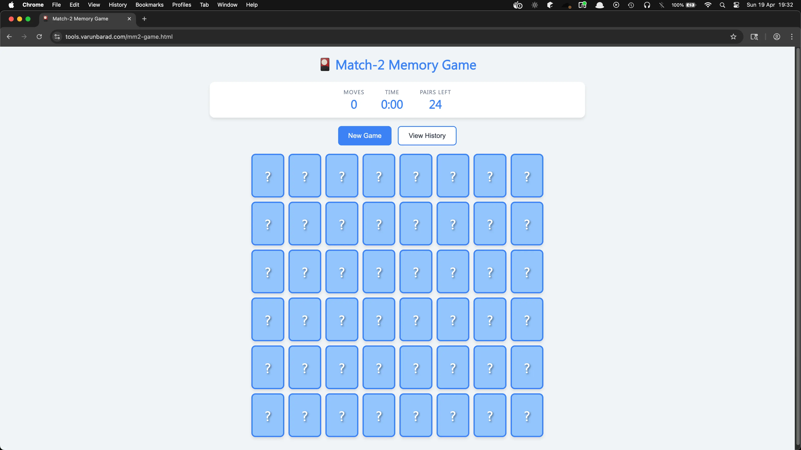

---
tags:
  - post
layout: post
title:  "Building single-page HTML tools"
summary: "The major LLMs are pretty good at building small single-page HTML tools, here's a few on my tool-belt"
date: 2026-04-19T18:58:28+0530
categories: 
  - "programming"
  - "tools"
  - "web"
---

Following [Simon Willison's advice](https://simonwillison.net/2025/Dec/10/html-tools/), I also started letting the LLMs loose on some of my tool needs which I thought could be concisely handled in a single web-page. That's how [https://github.com/VarunBarad/tools](https://github.com/VarunBarad/tools) was born.

Most of the code here is made simply by prompting in the web version of Claude, which is then later downloaded and added to this repo. I want to try the Gemini and GPT models for some future tools I decide to add.

## A4 ID Layout

I started with something that I deal with occasionally but is a huge pain every time that I have to do it. I try to keep my government IDs scanned and sorted so that whenever I need to submit one for documentation/registration/verification/whatever I can turn in a single page PDF which contains both the front and back of that ID. Previously I used to do this in GIMP, and while I had nailed down the process quite a lot, it was still a tedious task. I had to crop both the scans, rearrange both the cropped images, ensure they are the same size, apply the correct title text, export them as PNG, run it through an image-compression pass, convert it to PDF.

This time I tasked Claude to make a single-file HTML webpage where I can supply the two cropped images and the title text, and it will arrange everything and I can download the arranged image directly, with a built-in live preview. There was some back and forth, and I added a couple of requirements after seeing the first version. But voilà, I have what I need and its' going to be much smoother the next time I have to sort some other ID.

<figure>
   
  <figcaption style="text-align: center;">A definitely genuine driver's license for one John Wick</figcaption>
</figure>

## Gaming tracker

[Horizon Forbidden West](https://en.wikipedia.org/wiki/Horizon_Forbidden_West) is one of the games I am playing currently, and there is also [a podcast](https://mashthosebuttons.com/show/lightkeeper-protocol/) I listen to about the game. In each episode of the podcast, they mention in the show-notes what missions of the game they talk about, but I don't want to listen to an episode before I have played everything covered in that episode myself. But the game is so vast that it is difficult to keep track of the names of all the story missions, side missions, errands, etc. in your head.

I wanted a web-page where as I go along the game, I can tick off what missions I have completed so far. That way before listening to an episode of the podcast, I can check in my tracker whether I have completed all the in-game content covered in that episode. That led to the creation of the second tool in this tool-belt, HFW Quest Tracker.

Claude fetched all the mission names and made a webpage with the complete list separated neatly into categories. I had to add a bunch of the categories and its data as it did not bring them all in by itself, but it was small work. It stores the progress data in browser's local-storage as this is not something that I care about preserving in case my device dies.

<figure>
   
  <figcaption style="text-align: center;">Progress-state image exported directly from the tool</figcaption>
</figure>

## Random Starred Repos

I have in the past starred a lot of repos on GitHub, some of which I now look back and ponder why I did so. I want to clean up my starred repos, but I am not bothered enough with it to go through the complete list of my starred repos and then unstar any of the ones that I don't care about anymore.

But just checking five repos from there at a time is something I can do. So I asked Claude to make a webpage where I can enter the GitHub username and it gives me 5 random entries from all the repos starred by that account. Since this is all public data and the usage would be so low, I could simply go by with unauthenticated GitHub API calls.

Then from that list of five repos, I can open whichever ones seem un-star worthy and unstar them from GitHub. The added benefit of this tool is that as my starred list keeps getting leaner, I end up coming across interesting projects that are fun to revisit (today's hidden find was [https://github.com/boardgameio/boardgame.io](https://github.com/boardgameio/boardgame.io)).

<figure>
   
  <figcaption style="text-align: center;">Atleast three of these five repos are going to be un-starred</figcaption>
</figure>

## Memory Sharpener

I remembered a game from my childhood where you start with a bunch of face-down cards and progressively reveal them in pairs. And if the two cards you open are the same, then they are eliminated, else they are turned face-down again. This I think is a good game to work on the working-memory capacity of your brain.

I wanted a simple version where I could see the changes evaluated against my past attempts. I wanted to track both how long it took to complete the whole board and how many times I had to flip the cards. I want to keep both those numbers as down as possible. Again, this was completely made in the Claude web chat and then later added here. It uses [Chart.js](https://www.chartjs.org/) to render the historical performance chart and stores all data in local-storage.

You can play it yourself over at [https://tools.varunbarad.com/mm2-game.html](https://tools.varunbarad.com/mm2-game.html)

<figure>
   
  <figcaption style="text-align: center;">A blank board with all 48 cards face-down</figcaption>
</figure>

These are the ones I have made till now, I would keep adding more as my needs keep changing.
