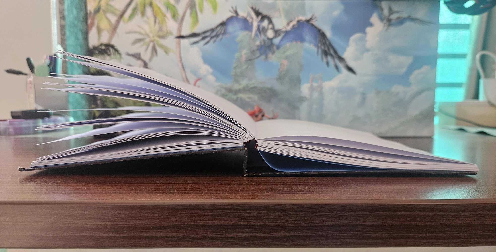
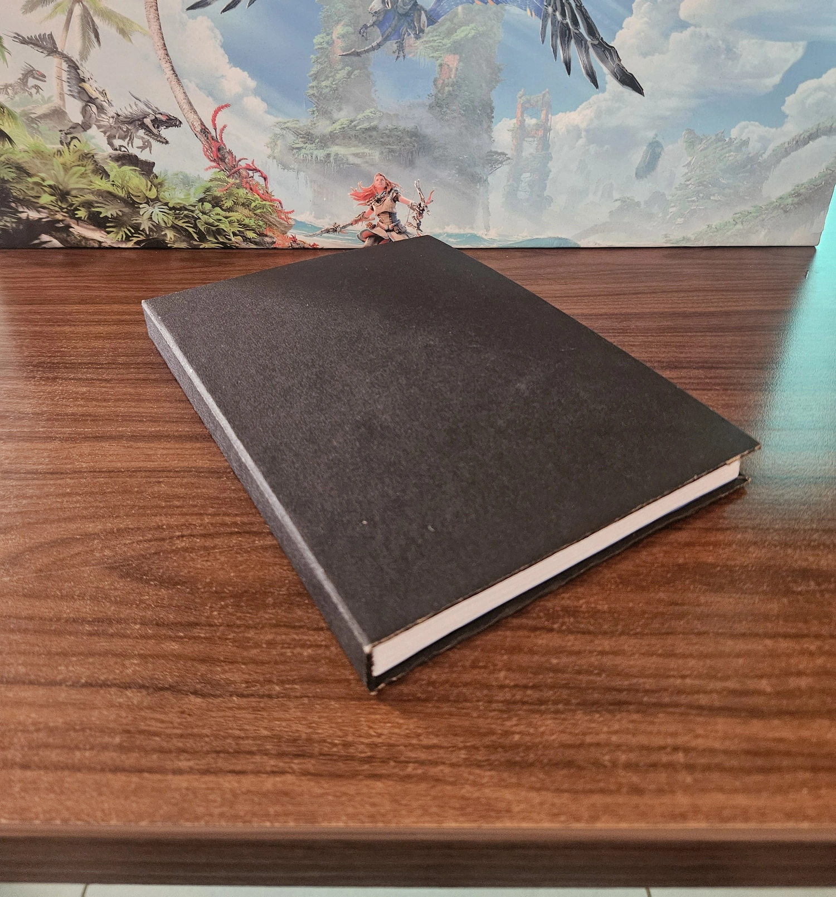
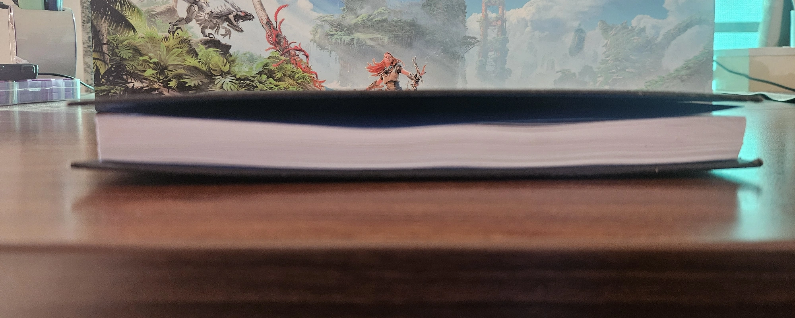
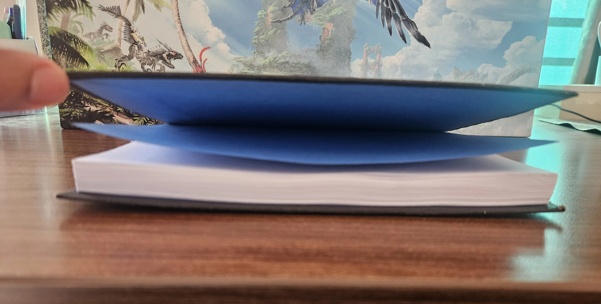
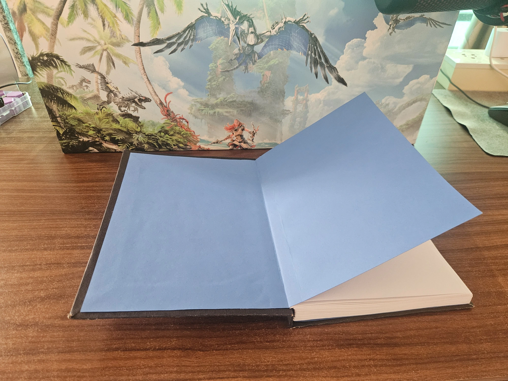
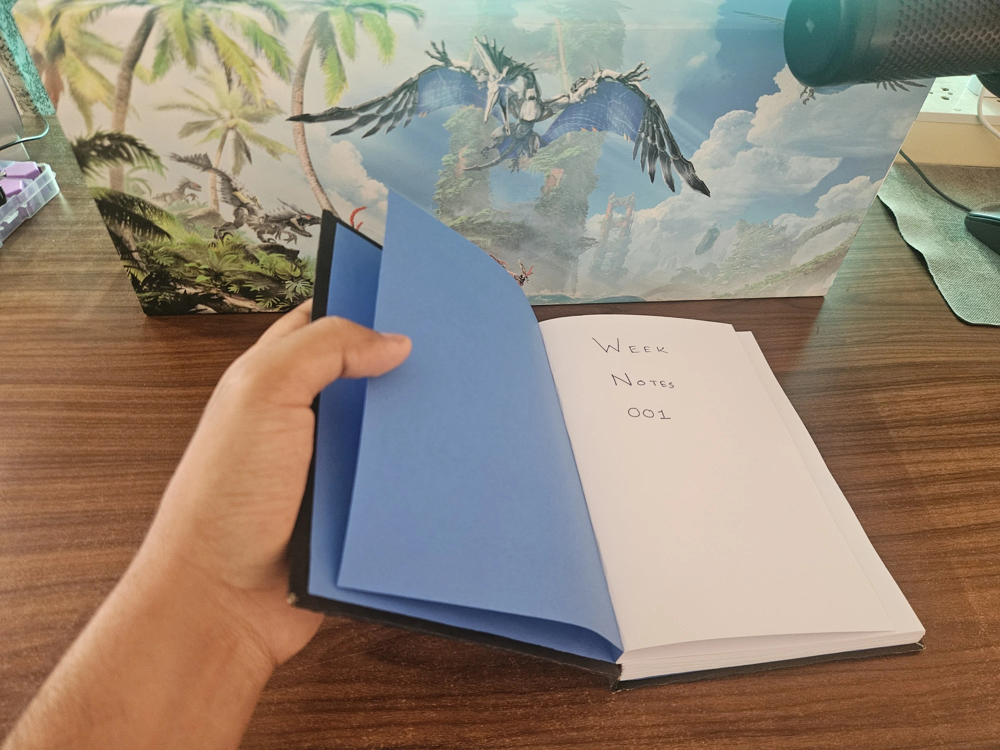
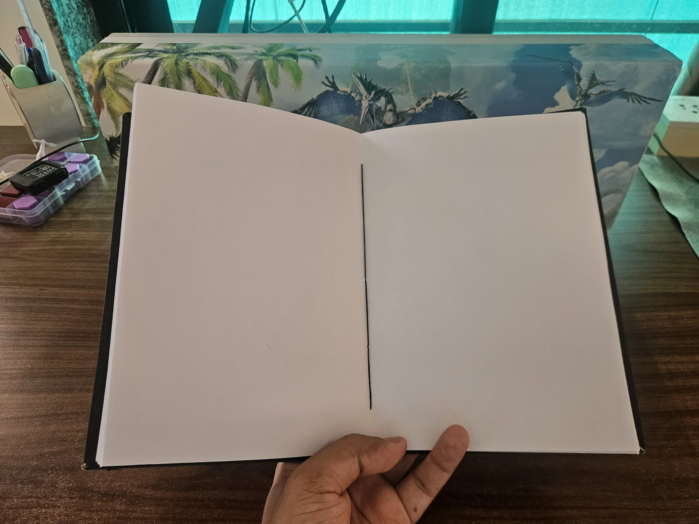

---
tags:
  - post
layout: post
title:  "I spent three years not finishing a notebook"
summary: "I started binding my own hardcover notebook in 2023, abandoned it, and finally saw it through to the end."
date: 2026-05-07T00:27:06+0530
categories: 
  - "bookbinding"
  - "personal-growth"
---

Around three years ago I saw a video on YouTube about someone binding their own book. In that one they were rebinding a paperback series into hardcovers, but later I also found a video where someone started from scratch and printed and bound their own hardcover. That is when it occurred to me that this is something individuals can do, and I wanted to try it myself.

I did some research and decided to bind an A5 sized blank notebook first. Access to A4 size paper (which is then folded into A5 sized signatures) is easy enough for me, and it meant I wouldn't have to worry about ensuring that the edges and text of the end-product are parallel to each other. I was very excited to have found something outside of computers and code that interested me.

I made a few trips around town to various shops and collected all my supplies. The process of making a hardbound notebook consists of roughly five steps:

1. Folding the signatures
2. Stitching signatures together to make the text-block
3. Attaching end-papers to the text-block
4. Making the cover by attaching outer material to pieces of cardboard
5. Joining the cover and text-block (with end-papers) together

## Folding and sewing the signatures

I started this project back in 2023, during either the summers or the pre-monsoon season. Folding the pages was long and tedious work, but it was not difficult. The difficulty for me started with the sewing stage. I had a couple of false starts which got stuck midway and had to be undone. I still remember it was one weekday afternoon when the clouds had turned it into an extremely wonderful and lazy day. My wife had her day off and I ended up taking the day off from work too because of the wonderful weather. That was when it finally clicked for me (after watching at least four different tutorials) what had to be done for proper sewing, and I ended up sewing all the signatures together just as the text-block needed.

After that was done, the complete text-block needed to be pressed under heavy weight so that the gaps introduced by the folding and stitching could be flattened out. Traditionally this is done with what is called a [book-press](https://graphicarts.princeton.edu/2017/02/01/how-many-nipping-presses-does-it-take-to-bind-a-book), but I don't have access to one. What I do have at home is a couple of F-clamps, a piece of plywood, and my table. I pressed the text-block overnight between my table and that piece of plywood using those two F-clamps.

<figure>
   
  <figcaption>Spongebob meme saying "Three years later"</figcaption>
</figure>

And somehow this project ended up going on the backburner for around three years after this point. I can't tell what conditions triggered this hiatus or why I never picked it up again before now. But somehow, a couple of weeks ago, I got determined to continue the project and see it through to fruition.

## Attaching the end-papers

I had decided to make the end-papers from some thin chart paper, as it would give that proper thick-paper feeling without much additional bulk and/or stiffness. Guess what happens to a couple of sheets of chart paper that have remained rolled up for three years, they did not want to lie flat. I had to unroll them, put them under some weight while flat, then roll them the opposite way, and only after unrolling and putting them under weight again did the sheets lie flat enough for me to measure and cut a couple of A4 sized pieces from them.

At this point, I had completely forgotten what all those tutorials had taught me, and so had to go hunting for instructions again. Guess what field has a bunch of ways of doing things which are just slightly different from each other? Yes, it is bookbinding. In the process of tracking down which person I had originally seen the video from, I found a couple of deep resources on bookbinding: [Four Keys Book Arts](https://www.youtube.com/c/FourKeysBookArts) and [DAS Bookbinding](https://www.youtube.com/c/DASBookbinding). Both are very useful when learning binding, but since I wanted to follow the original set of instructions I eventually found the [Jess Less](https://www.youtube.com/@JessLess) videos again.

After all this I finally figured out how to attach the end-papers, and therefore what size to cut them and how to attach them. I also had some binding-cloth which I used on the text-block spine to glue everything together more securely.

The next step was to make the cover, but I found the text-block edges to be quite misaligned rather than perfectly flush. So I decided to give the text-block a small trim on the three sides that would remain exposed (top, bottom, and the outer edge). One edge came out clean but the other two were quite wavy across different layers at the same place.

## Preparing the covers

Preparing the covers involves cutting two pieces of cardboard just slightly bigger than the text-block's width and height, since the cover needs to overhang the text-block a little. A third piece of cardboard covers the spine area. Then you arrange them on the cover material with enough space between them for the book's corners and the room it needs when the book opens. I was using a slightly thicker black chart paper as the cover material. This was a mistake, as it is a very rigid paper with not much give in any direction. Having a bit of give is very useful when the cover has to change shape around the folded edges as the book opens. Another mistake I made was not leaving enough space between the spine cardboard and the front/back cardboards.

These two mistakes combined have made it so that when I open my notebook it doesn't have the tolerances required, and so it decides to unstick one of the end-papers to make the necessary space 😅.

<figure>
   
  <figcaption>You can see the endpaper getting unstuck near the spine</figcaption>
</figure>

## Joining the text-block and the cover

This part is essentially gluing the end-papers to the insides of the cover prepared earlier. The combination of my cardboard and the covering material had become quite stiff. I was able to glue the first end-paper nicely, but the combination of a stiff cover with not enough space between the face-cover and spine-cover caused a lot of trouble when gluing the second one.

After all this, I was ready to put everything under the book-press one final time. This time it had to be kept under weight for around 8–12 hours. And boy, did the clock not want to move during those hours. It was excruciating to wait, as I had not followed the general practice of doing this last press overnight and instead started it first thing in the morning. So I could see it the whole time but couldn't open it.

## The End Result

I gave up after around six hours and took it out of the press. While I was finding a lot of flaws with the end-product, I was extremely glad with the result for a first attempt. Some things that I will change for my next attempt:

- Actually check the grain direction of the paper and follow expert advice on printing and cutting direction
- Use a cloth-like covering material
- Leave appropriate spacing between the face-cover and spine-cover cardboards
- Maybe skip the spine-cover cardboard entirely and use a spine-stiffener instead
- Use proper wooden boards to press the book in between
- Alternate the signature directions when putting them under the book-press before sewing
- Keep the spine outside of the press when putting it under book-press after sewing the signatures together
- Take far more caution when trimming the signature edges

<figure>
   
  <figcaption>This is how the final book looks, quite pleased with it</figcaption>
</figure>

<figure>
   
  <figcaption>You can see how the cover-boards have warped towards the inside from this angle</figcaption>
</figure>

<figure>
   
  <figcaption>And here's the endpaper warping in the other direction, the cover boards also warp mostly because of the endpapers</figcaption>
</figure>

<figure>
   
  <figcaption>This is how the endpapers look glued down with the cover and the text-block</figcaption>
</figure>

<figure>
   
  <figcaption>From the title-page you can see that I have started my first foray into writing week-notes</figcaption>
</figure>

<figure>
   
  <figcaption>This is how the sewing looks like from inside; I think I should buy a white thread</figcaption>
</figure>

Thanks for reading about my first step in trying to find a hobby outside of digital screens. This has my attention captured, and I can already think of a lot of different binding projects I would like to follow up with. One dream project would be to someday have my own bound set of [Harry Potter and the Methods of Rationality](https://hpmor.com). But that is in the future, for now I need to decide what I am going to bind next.
