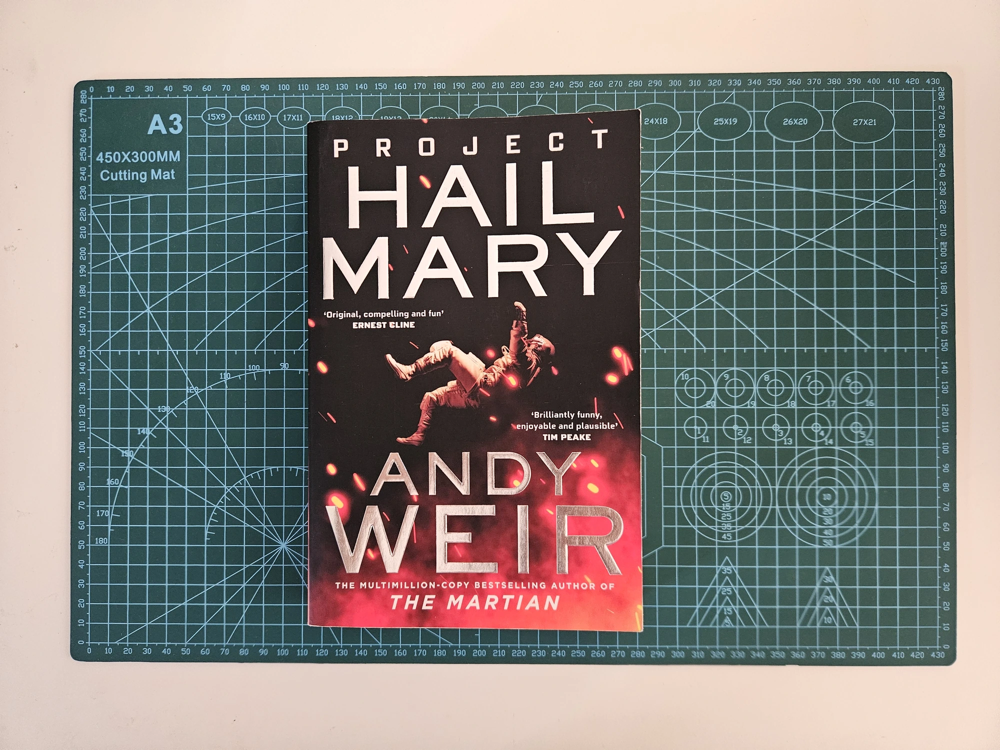
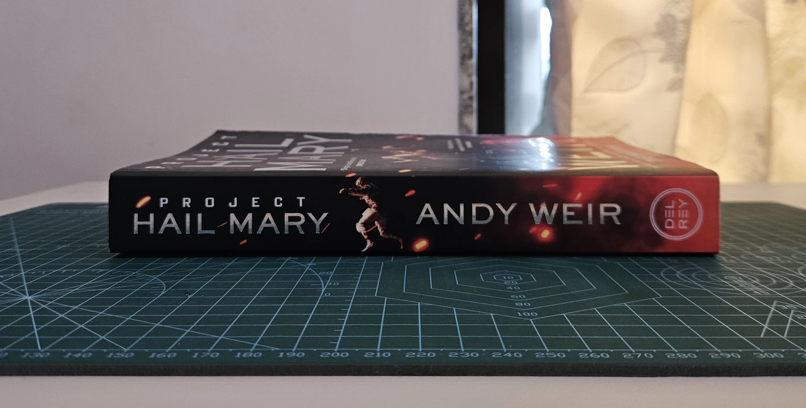
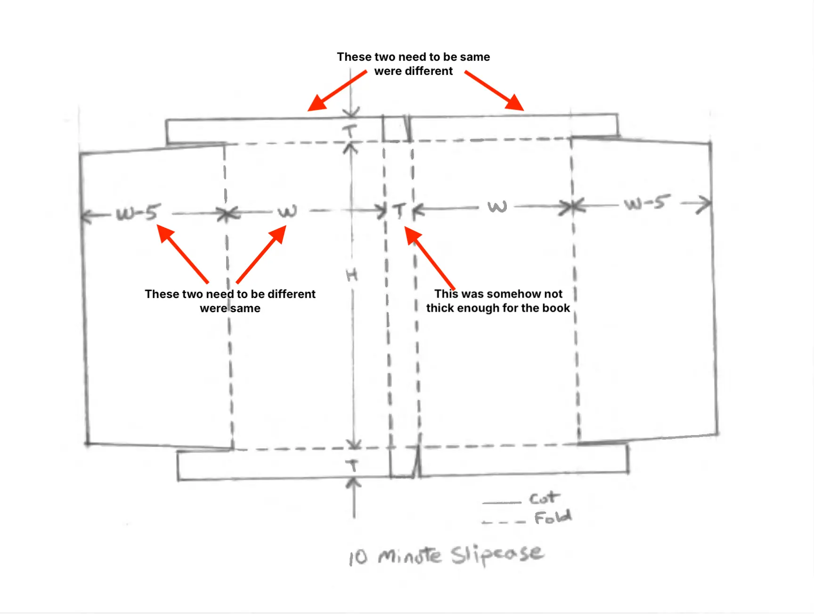
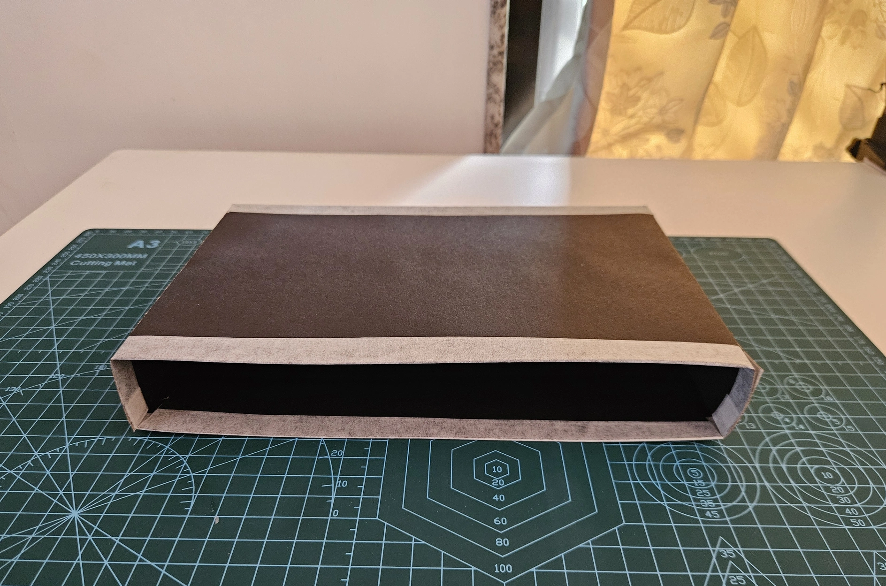
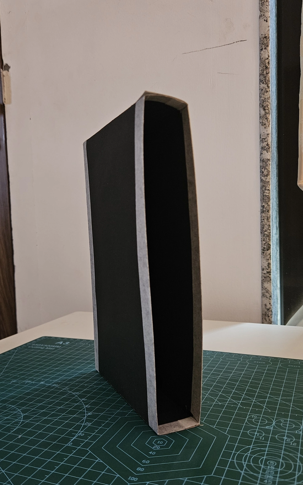
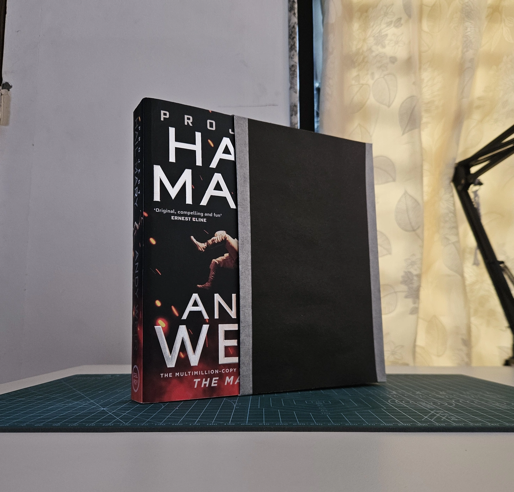
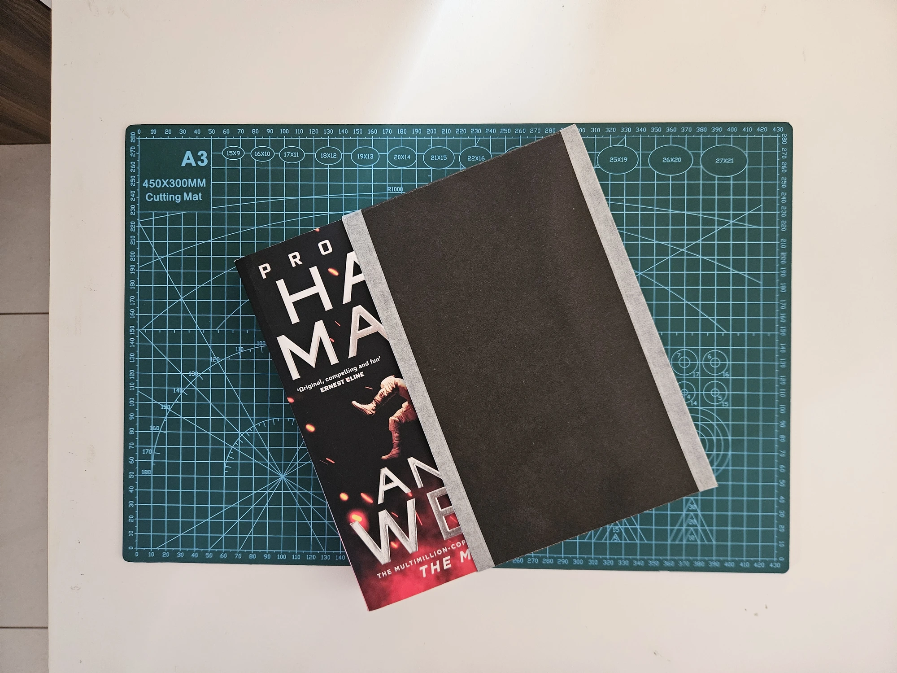
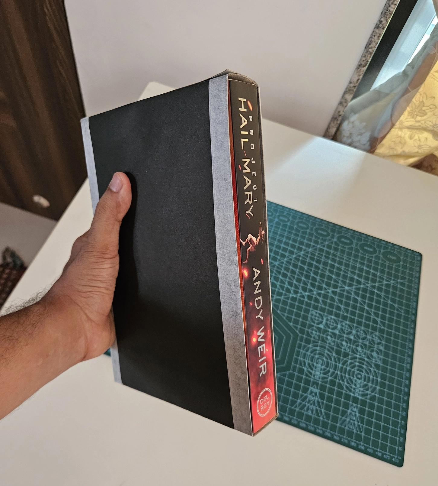

---
tags:
  - post
layout: post
title:  "Snugly sized slipcase"
summary: "I made my first slipcase but my book doesn't slip into it."
date: 2026-06-09T07:18:53+0530
categories: 
  - "bookbinding"
---

I am still working on the typesetting for the next book that I want to bind. Meanwhile, I thought I'd build a slipcase for one of my existing books, a copy of __Project Hail Mary__ from before it became a movie. That way I can ensure I don't get stuck to a screen in pursuit of my off-screen hobby, and making protective covers for my books will be a good skill to have.

I followed the [DAS Bookbinding](https://www.youtube.com/@DASBookbinding) video on [10 minute slipcase](https://www.youtube.com/watch?v=YnIKGBTMCgo).

## Selecting the book

The first step was deciding which book to make the case for. I decided to go with my chonky paperback copy of __Project Hail Mary__. A couple of reasons I want to protect it: it is one of the best pieces of science fiction I have ever read, and more importantly, it has the cover art from before the movie posters completely took over.

<figure>
   
  <figcaption>Top-view of my paperback copy of Project Hail Mary (cutting-mat for scale)</figcaption>
</figure>

<figure>
   
  <figcaption>View from the spine of it (look how thick this thing is)</figcaption>
</figure>

That was my first mistake, I should have selected something much smaller, as that would have made measuring and cutting the covering material a lot easier. My biggest hurdle in this project was that my ruler only had markings up to 300mm, but even the smaller side of the rectangle I had to cut was 334mm. So it would have gone easier if either I had selected a smaller book or I had a longer ruler.

## What could go wrong, did

I decided to continue with the black chart paper I had used for my last (also first) notebook, as it was both available at hand and stiff enough for the purpose. My wife recently got me an awesome cutting mat and awl. In my wisdom, I decided that since I didn't have a bone-folder, I'd use the awl as a creaser. It made quite a crisp crease, in fact it was so crisp that as soon as I folded the chart paper along it, it gave away and tore itself on that crease 🤦. Because of that, I decided to reinforce many of the edges with paper-tape.

After cutting out all the parts, when I started folding along the creases, I noticed some problems with my measurements: I didn't have enough space at the center for my book spine, also for some reason the parts meant to be 5mm different were turning out to be the same. Nor were the two halves (for top and bottom of the case) of opposite sides matching properly in their width. Therefore, I had to make a few adjustments on the fly. These adjustments did help me finish the project, but I suspect they may also be why the fit ended up so snug.

<figure>
   
  <figcaption>Annotated image of the mismatched dimensions</figcaption>
</figure>

Then when it came time to glue everything together, I applied the glue directly from the nozzle of the bottle to the appropriate area. This was another mistake as this didn't allow me to properly adjust the amount of glue I apply. I should have used a glue brush as that allows for a much smaller and consistent amount of glue to be applied. My problem here was less of consistency and mostly of excess glue on the paper. That excess glue caused the paper to warp in places.

After all that, my first slipcase was ready. Here are some photos of the final product.

<figure>
   
  <figcaption>The final slipcase lying on its side</figcaption>
</figure>

<figure>
   
  <figcaption>In the standing position we can see that the chart-paper is stiff enough for this job</figcaption>
</figure>

<figure>
   
  <figcaption>The book fits, a bit snugly, but it fits</figcaption>
</figure>

<figure>
   
  <figcaption>A photo of the book partially inserted in the case, just because I think it looks nice</figcaption>
</figure>

<figure>
   
  <figcaption>The tapes look a bit hideous, but the paper feels nice in hand</figcaption>
</figure>

There is now a higher chance of the book getting damaged from me trying to put it in the slipcase than from it just sitting on the shelf. But it is made. The mistakes that must accompany the first version of anything have been duly made, and the second version will be made much better. Some things I would change in my workflow before the second attempt:

- Get a bone-folder (_already ordered_)
- Get a longer steel ruler (_next time I visit the market_)
- Get a brush and an open container for glue
