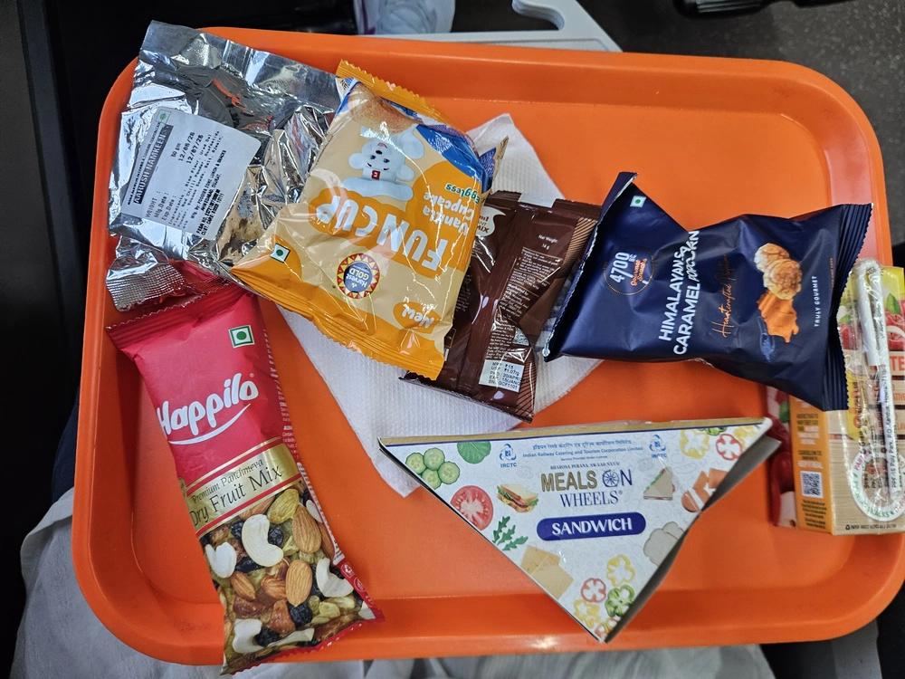
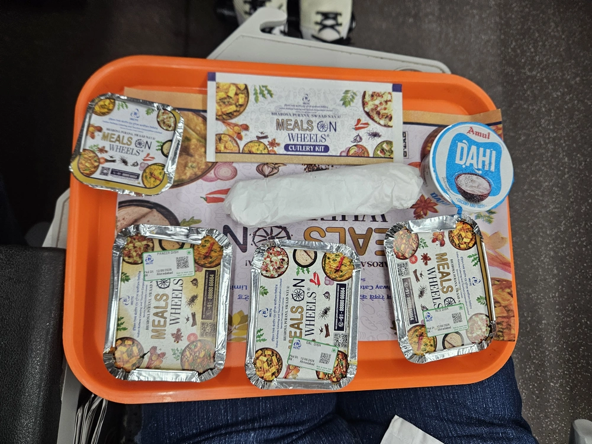
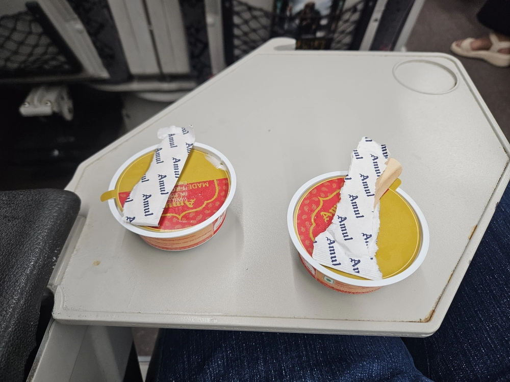
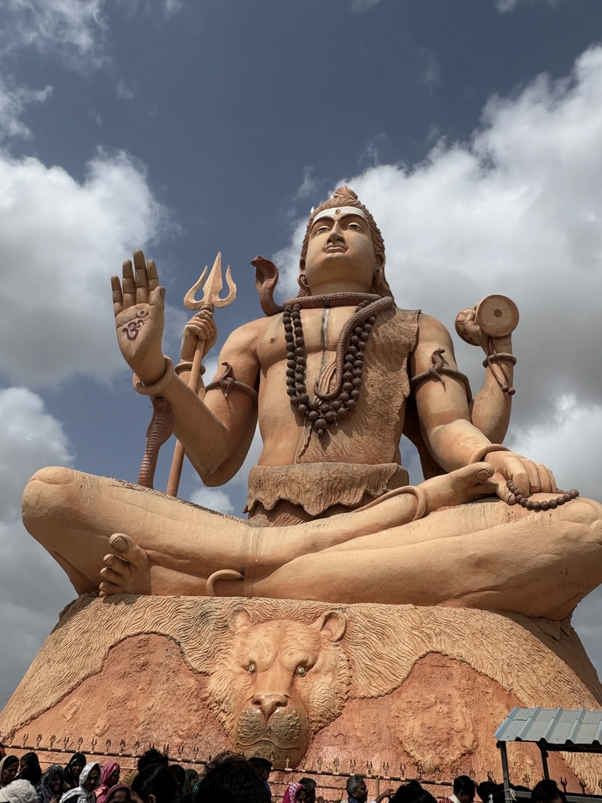
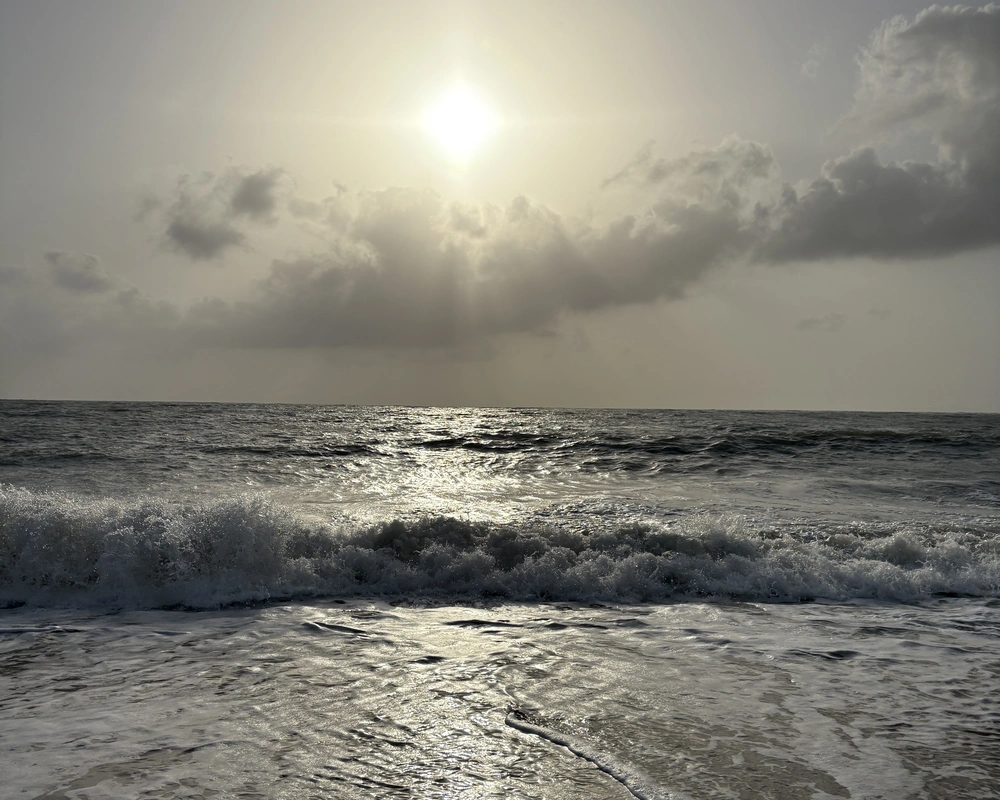
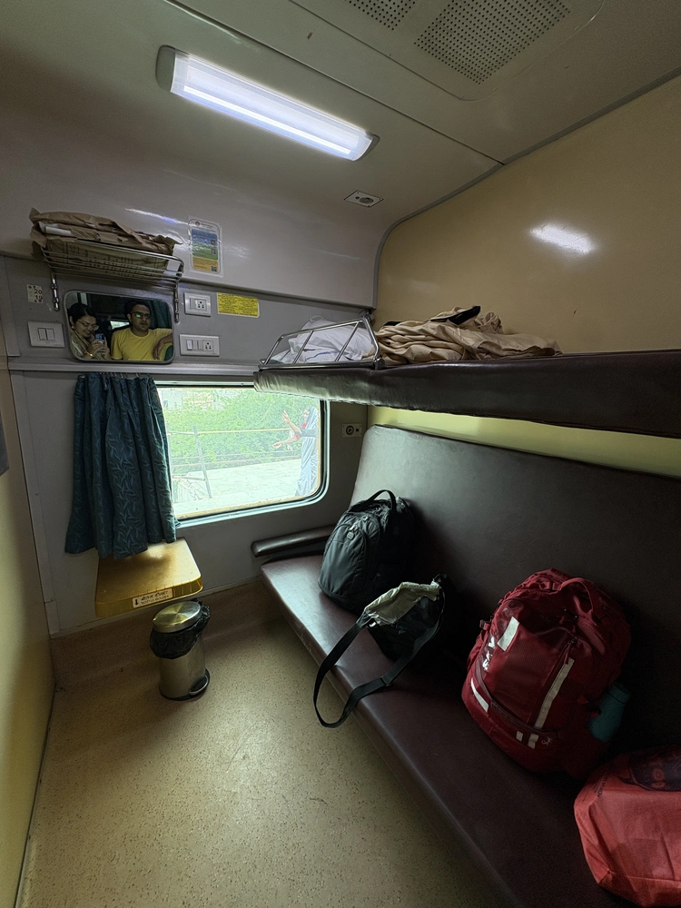
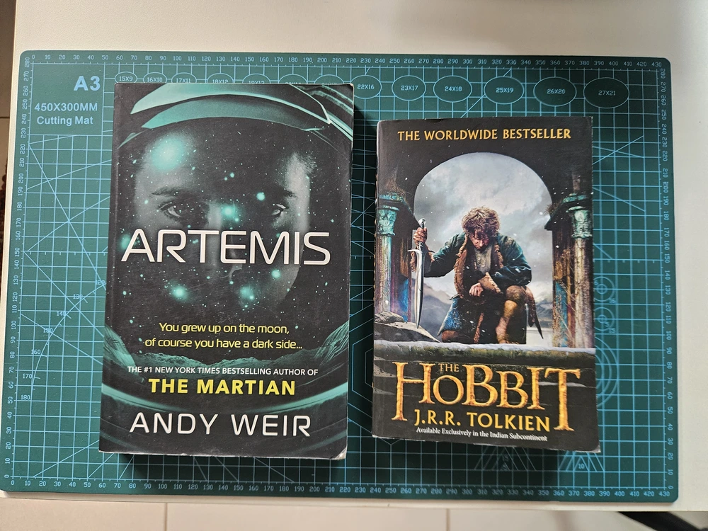
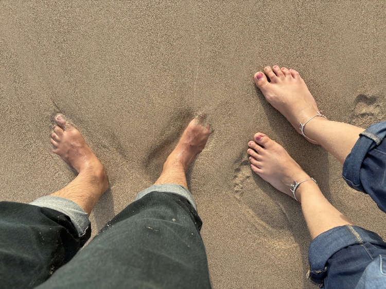

---
tags:
  - post
layout: post
title: "🧳 Dwarka Trip 2026"
summary: "I went to meet The Dwarkadhish for my first pilgrimage"
date: 2026-07-10T09:39:55+0530
categories:
  - "travel"
---

This time when planning a short trip around our anniversary, me and my wife decided to visit Dwarka. Neither of us have been to any of the Chardham temples before. This would be our start on that journey. This time it was a three-day trip with us leaving from home on a Friday afternoon and reaching back on Sunday night.

## Friday — Indian Railways rocks

This day completely went in reaching to Dwarka. We had to take a train from Anand to Ahmedabad and then switch to a Vande Bharat from Ahmedabad to Dwarka. We reached Dwarka a bit after midnight. I had taken [The Hobbit](/blog/book-the-hobbit) to read on our journey, and Janki started the book [Artemis](https://openlibrary.org/works/OL17837968W/Artemis).

I learnt two new things that day. First, on Ahmedabad Junction railway station they have divided atleast one of the platforms and made it into two platforms. What initially used to be "Platform 2" on one side and "Platform 3" on the other side is now demarcated into one side being "Platform 2" and further down the same one changing to "Platform 2A" and the other side being "Platform 3".

The other thing I learned was that at nighttime in Dwarka there is a flat-rate system of ₹200 per rickshaw. It doesn't matter where you have to go within Dwarka, it will cost you ₹200.

We stayed at ["The Grand Dwarika"](https://maps.app.goo.gl/QXSAHnLmM8rdEpoN6) hotel, and I would wholly recommend that stay to anyone going there as it is just a short stroll from both the sea and the main Dwarkadhish temple. Especially if you ask for room number 7 on any floor (like 207, 307, etc.) then you will get a view of the Gomti river, the Arabian Sea and the main temple.

<figure>
  
  <figcaption>Our tickets included meals so there was an awesome evening tea package</figcaption>
</figure>

<figure>
  
  <figcaption>There was so much food for dinner that I had to send some back</figcaption>
</figure>

<figure>
  
  <figcaption>There was even ice-cream afterwards 😍</figcaption>
</figure>

> PS: That heart-eyes emoji in italic font-style looks real bad.

## Saturday — Visiting the Dwarkadhish temple and roaming around town

On Saturday we had planned our day so that we would first visit the main temple, then come back to the hotel to change and freshen up as desired. Then we would leave for other spots in/around Dwarka after that. Our hotel had a free drop-off service for their guests to go to the main temple. After breakfast, we left for the temple. The hotel reception staff had informed us that mobiles and other digital devices are not allowed inside the temple, so we had left our phones in the room.

The first stop we encountered was a counter where we could store our footwear. Luckily there was no queue there, and we also got a vacant spot, so we deposited our sandals. From there me and Janki got separated because of different queues for males and females, we would be meeting again after coming out of the temple. There was a lot of footfall, but I still got a nice opportunity for peaceful darshan at every place. I even got to witness the flag-changing ceremony.

<figure>
  
  <figcaption>This is the biggest idol of Lord Shiv I have ever seen</figcaption>
</figure>

After lunch, we had hired a rickshaw for the day (the driver was the brother of our rickshaw driver from last night) to take us to various sightseeing spots around Dwarka. We could not visit [Beyt Dwarka](https://maps.app.goo.gl/FUA9KCwMeugpYG2s9) because of a traffic jam, but we got to visit [Nageshwar Jyotirling Temple](https://maps.app.goo.gl/kcANnUKVQFX7Mpa2A), [Gopi Talav](https://maps.app.goo.gl/4WdNehs6RE9WgZvn9) and [Shivrajpur Beach](https://maps.app.goo.gl/Zgzfrx8ngFw4HuQc9).

<figure>
  
  <figcaption>The silver sunset at Shivrajpur beach</figcaption>
</figure>

## Sunday — Back to base

Sunday was our train ride back from Dwarka to Anand (we did not need to switch trains this time). This was both mine and Janki's first experience in a first-class compartment. Luckily, we got a compartment of two all to ourselves, so we had complete privacy and didn't have to share the space with someone else. This was a huge space for two people with the allocation being one on top of the other. We put all our luggage on the upper berth and commandeered the lower berth with our books in hand.

<figure>
  
  <figcaption>The most luxurious train ride I ever experienced</figcaption>
</figure>

Our day was spent mostly reading with some napping interspersed throughout. We got some up-close views of some windmills from our window. By the time evening rolled around, me and Janki had entered into a competition of who finishes their book first (she won by the way). Both of us managed to finish the books we were reading (["The Hobbit"](/blog/book-the-hobbit) for me and ["Artemis"](https://openlibrary.org/works/OL17837968W/Artemis) for Janki).

<figure>
  
  <figcaption>These books were the bookends of this trip</figcaption>
</figure>

This experience of being able to get peace of mind for the journey was cool enough that we think we might prefer to take first-class for the longer journeys going forward. We reached Anand sometime after 9 pm.

<figure>
  
  <figcaption>At the beach I was trying (and succeeded) to get my complete foot buried in the sand</figcaption>
</figure>
