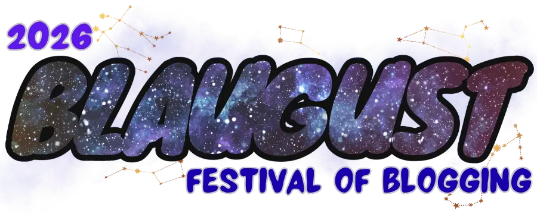

---
tags:
  - post
layout: post
title: "⚔️ Blaugust 2026 — Here I come"
summary: "I have decided to re-enter the Blaugust challenge this year, but this time it is to honour a fallen hero"
date: 2026-07-15T18:20:07+0530
categories:
  - "blaugust-2026"
---

This past Sunday I learned Belghast, the person who initiated Blaugust more than 10 years ago, passed away on 02 July 2026. Last year was my first time participating in Blaugust. I was on the fence so far as to whether I will participate this year or not. But it is decided now, I will participate this year too. I would be participating to honour the memory of Belghast.

From my experience participating last year, I can wholeheartedly say that the Blaugust community is one of the best online communities I have ever seen. Thank you Belghast for creating such a welcoming space, I have met literally zero toxic people in here. It is in the blaugust discord that I found [a post](https://troypress.com/participating-in-blaugust-2026/) mentioning that Belghast passed away. From another [blog post](https://tamrielo.com/goodbye-bel/) (by a close friend of Bel) I found out the circumstances and how he was still writing and sharing blog posts till [his last day](https://aggronaut.com/2026/07/01/mapping-in-poe2-kinda-sucks/).

So I have come this far and not introduced what Blaugust is. To keep it brief, Blaugust is a month-long event where people write to their blogs. There are some optional challenges and badges to go along if you complete any of them. But at its core it is celebrating independent blogs and writing by humans for humans. If you want to read the official announcement, then please look at [Krikket's post](https://nerdgirlthoughts.game.blog/2026/07/15/blaugust-2026-is-coming/). If you want to read it in a Q-and-A format, then I would point you to [Contains Moderate Peril](https://www.containsmoderateperil.com/blog/2026/7/14/blaugust-2026-q-ampa). And if you want to know who "Community Builder Badger" is, then you should check out the [post by Bhagpus](https://bhagpuss.blogspot.com/2026/07/blaugust-is-back-baby-or-it-will-be-in.html).

In my [reflection post](/blog/blaugust-2025-outro) about Blaugust 2025 I mentioned that I [won't be targeting the 31 posts again](/blog/blaugust-2025-outro#:~:text=but%20I%20won%27t%20be%20setting%20the%20same%20target%20for%20myself). When I heard of Bel's passing, I initially thought that I would attempt the 31 posts again in honour of Bel's memory. But realised that a more appropriate way would be to rather focus more on the community than on individual blog post targets. So, this year I will be focusing on the [Community Builder Edition](https://nerdgirlthoughts.game.blog/2026/07/15/blaugust-2026-is-coming/#:~:text=Blaugust%20%E2%80%93%20Community%20Builder%20Edition) of Blaugust for this year. This means I will have to complete atleast three of these challenges (but I intend to target all of them):

- Make a post on your blog on or before August 1st, 2026 inviting other bloggers to participate in Blaugust. Make sure you link the signup form. 
- Make at least 5 posts directly inspired by a post by another Blaugust participant. Make sure you provide a link back to the post in question. 
- Engage with other Blaugust participants at least once per week.  Read posts, leave comments, join discussions in the Blaugust Discord and share posts written by others on social media. 
- Guest post on another Blaugust participant’s blog – or have someone else guest post on yours!
- Create or join in a group project – choose a topic, find some other bloggers, and each post your own take on that topic on the same day.

Another thing that I liked last year were Nik's weekly retrospectives (specimens [first](https://nkantar.com/blog/2025/08/blaugust-2025-links-part-1/), [second](https://nkantar.com/blog/2025/08/blaugust-2025-links-part-2/), [third](https://nkantar.com/blog/2025/08/blaugust-2025-links-part-3/) and [fourth](https://nkantar.com/blog/2025/10/blaugust-2025-links-part-4/)) on which posts he liked. I think I might try that this time around.

If you already have a blog/website, then I would like to see you participate and I would like to read what you write. Heck, if you don't have a website then get in touch and I can either help set something for you or you can even publish on my website (with proper attribution to you, of course). Here is the link to the [official sign-up form](https://forms.gle/SfUWUMpFQxBFbF9N9), go ahead and register and let me know where you will be writing.

<figure>
  
  <figcaption>Blaugust 2026 banner</figcaption>
</figure>

## Edits

- Changed link to point to current year's official announcement post
- Added link to Blaugust 2026 sign-up form
- Added this year's community builder edition challenges
- Fixed punctuation
